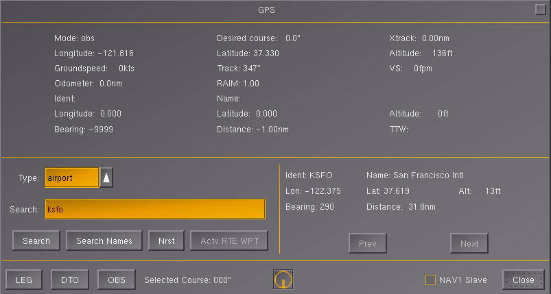
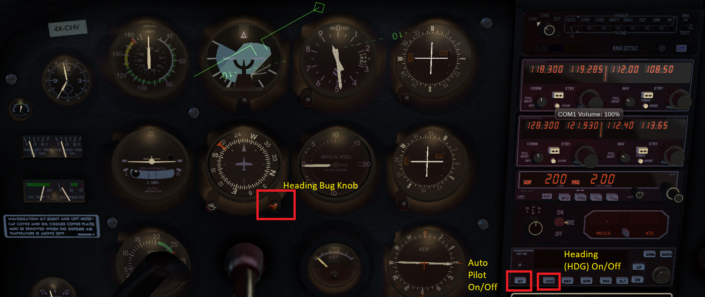
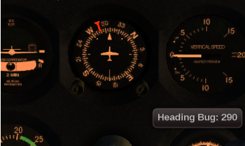

# FlightGear Cessna 172p - Autopilot and GPS Navigation Guide

## Table of Contents
1. [Introduction](#introduction)
2. [Autopilot Limitations in Cessna 172p](#autopilot-limitations-in-cessna-172p)
3. [Autopilot Controls](#autopilot-controls)
4. [Heading Hold (HDG)](#heading-hold-hdg)
5. [Altitude Hold](#altitude-hold)
6. [NAV Hold](#nav-hold)
7. [GPS Navigation](#gps-navigation)
8. [Complete Navigation Example](#complete-navigation-example)
9. [Autopilot Best Practices](#autopilot-best-practices)
10. [Troubleshooting](#troubleshooting)

---

## Introduction

The autopilot is a valuable tool that can reduce workload during flight, allowing you to focus on navigation, radio communication, and flight planning. The Cessna 172p in FlightGear features a simple but effective autopilot system.

---

## Autopilot Limitations in Cessna 172p

### Important Note

**The Menu-based Autopilot is disabled** in Cessna 172p. Instead, use the **instrument panel autopilot**.

**What Works**:
- ✓ Instrument panel HDG (Heading) button
- ✓ Instrument panel ALT (Altitude) button
- ✓ Instrument panel NAV button
- ✓ Keyboard shortcuts (some)

**What Doesn't Work**:
- ✗ F11 Autopilot dialog (disabled)
- ✗ Some advanced autopilot menu functions

### Workaround

Use the **physical autopilot panel** in the cockpit:
1. Click **AP** button to enable autopilot
2. Click mode buttons (HDG, ALT, NAV) to engage specific functions
3. Adjust parameters using instrument knobs

**Reference**: https://forum.flightgear.org/viewtopic.php?f=40&t=12190

---

## Autopilot Controls

### Keyboard Shortcuts

| Key | Function |
|---|---|
| **Backspace** | Toggle autopilot on/off |
| **Ctrl + A** | Toggle altitude lock |
| **Ctrl + G** | Toggle glide slope lock (NAV 1) |
| **Ctrl + H** | Toggle heading hold |
| **Ctrl + N** | Toggle NAV 1 lock |
| **Ctrl + S** | Toggle autothrottle |
| **Ctrl + T** | Toggle terrain follow (AGL) lock |
| **Ctrl + U** | Add 1000 ft to altitude (emergency) |
| **F6** | Toggle autopilot heading mode |
| **F11** | Autopilot altitude dialog (may not work in C172p) |

### Autopilot Instrument Panel

Located in center of instrument panel:

**Buttons**:
- **AP** - Autopilot Master (On/Off)
- **HDG** - Heading Hold
- **NAV** - NAV tracking
- **APR** - Approach mode
- **REV** - Reverse mode
- **ALT** - Altitude Hold
- **UP/DN** - Altitude adjust

---

## Heading Hold (HDG)

### What is Heading Hold?

HDG mode maintains a specific magnetic heading automatically. The aircraft will turn to and maintain the heading set on the Heading Indicator.

### How to Use HDG Mode

#### Step 1: Set Desired Heading

**Using Heading Indicator Knob**:
1. Locate the **Heading Indicator** (gyro compass instrument)
2. Find the **HDG bug knob** (usually bottom-right of instrument)
3. Turn knob to set desired heading
4. **Heading bug** (small arrow/triangle) moves to desired heading


*Heading indicator showing HDG bug knob (bottom-right) and heading offset warning (left knob)*

**Important Note**: Only adjust the HDG bug knob (right side). **Do NOT** turn the Heading Offset knob (left side) - see warning in image above.

**Example**: To fly to bearing 290°:
- Turn HDG bug knob until bug points to 290°

#### Step 2: Enable Autopilot

1. Click **AP** button on autopilot panel
2. AP button should illuminate or show active


*Autopilot panel with AP, HDG, NAV, APR, ALT buttons*

#### Step 3: Engage HDG Mode

1. Click **HDG** button on autopilot panel
2. HDG button illuminates
3. Aircraft automatically turns toward set heading

#### Step 4: Aircraft Turns Automatically

- Aircraft banks and turns to heading 290°
- Maintains standard rate turn
- Levels wings when heading is reached
- Holds heading automatically

### Adjusting Heading in Flight

**While HDG mode is active**:
- Turn HDG bug knob to new heading
- Aircraft immediately begins turn to new heading
- No need to disengage/re-engage

### Disengaging HDG

**Method 1**: Click **HDG** button again
**Method 2**: Click **AP** button (disengages all autopilot)
**Method 3**: Press **Backspace** (toggles autopilot off)

---

## Altitude Hold

### What is Altitude Hold?

ALT mode maintains current altitude or climbs/descends to a set altitude.

### How to Use ALT Mode

#### Step 1: Establish Desired Altitude

**Method A**: Climb/descend manually to target altitude first
**Method B**: Use autopilot altitude selector

#### Step 2: Engage Altitude Hold

1. Ensure **AP** is ON
2. Click **ALT** button
3. Aircraft maintains current altitude

#### Step 3: Adjust Altitude (if equipped)

Some autopilot versions have UP/DN buttons:
- **UP** - Climb to higher altitude
- **DN** - Descend to lower altitude

### Manual Altitude Hold Technique

If altitude selector doesn't work:
1. Manually climb/descend to desired altitude
2. Level off at target altitude
3. Engage **ALT** when stable at desired altitude
4. Autopilot maintains that altitude

---

## NAV Hold

### What is NAV Hold?

NAV mode tracks VOR radials or ILS localizers automatically.

### Prerequisites

1. NAV radio tuned to VOR or ILS
2. OBS set to desired radial (for VOR)
3. Aircraft within range of station
4. CDI needle visible and responding

### How to Use NAV Mode

#### Step 1: Tune and Identify Station

1. Tune NAV1 to VOR or ILS frequency
2. Verify station identifier (Morse code)
3. Adjust OBS to desired radial (VOR only)

#### Step 2: Intercept Course

**Manual Method**:
1. Fly to intercept the radial
2. Get CDI needle within 1-2 dots of center

**HDG Method**:
1. Use HDG mode to fly intercept heading
2. Wait for CDI to approach center

#### Step 3: Engage NAV Mode

1. When CDI is 1-2 dots from center:
   - Click **AP** (if not already on)
   - Click **NAV** button
2. Aircraft automatically:
   - Turns to track radial
   - Centers CDI needle
   - Maintains tracking

#### Step 4: Monitor

- Aircraft automatically corrects for wind drift
- CDI remains centered
- Aircraft follows radial TO or FROM station

### NAV Mode with ILS

Same procedure for ILS approaches:
1. Tune ILS frequency
2. Intercept localizer
3. Engage **NAV** mode
4. For full ILS: Engage **APR** (Approach) mode
   - Tracks both localizer and glideslope

---

## GPS Navigation

### Accessing GPS

**Method 1: Menu**
- Press **F10**
- **Equipment → GPS Settings**

**Method 2: Instrument Panel**
- Click GPS unit (if equipped)

### Setting Up GPS Navigation

#### Step 1: Select Destination

1. Open GPS Settings
2. **Type**: Select "Airport"
3. **Search**: Enter airport code (e.g., KSFO)
4. Click on result
5. Note **Bearing** displayed (e.g., 290°)

#### Step 2: Close GPS Dialog

- GPS has provided you with bearing to destination
- Don't need to keep dialog open

#### Step 3: Set Heading

1. Find Heading Indicator
2. Set **HDG bug** to the bearing from GPS (290°)


*WARNING: Do NOT adjust the Heading Offset knob (left side) - only use HDG bug knob (right side)*

**Important**: Do **NOT** adjust the Heading Offset knob (left side knob)
- Only use HDG bug knob (right side)

#### Step 4: Engage Autopilot

1. Click **AP** button
2. Click **HDG** button
3. Aircraft turns to bearing 290°

#### Step 5: Monitor Progress

**Use Map**:
- **Equipment → Map** (or **Ctrl + M**)
- Watch aircraft turn and track toward destination
- Monitor distance to destination

---

## Complete Navigation Example

### Scenario: Navigate from KHAF to KSFO using GPS and Autopilot

#### Phase 1: Departure

1. **Takeoff** from KHAF runway 30
2. **Climb** to 3500 ft
3. **Level off** and establish cruise speed (100 kt)

#### Phase 2: GPS Setup

1. Press **F10** → **Equipment → GPS Settings**
2. **Type**: Airport
3. **Search**: KSFO
4. Click search result
5. Note **Bearing: 290°**
6. Close GPS dialog

#### Phase 3: Set Heading

1. Locate **Heading Indicator**
2. Turn **HDG bug knob** (bottom-right)
3. Set bug to **290°**

#### Phase 4: Engage Autopilot

1. **While flying**:
   - Click **AP** button (autopilot master on)
   - Click **HDG** button (heading hold on)
2. Aircraft automatically turns to 290°

#### Phase 5: Monitor

1. Open **Map**: **Ctrl + M**
2. Watch aircraft track toward KSFO
3. Monitor distance

#### Phase 6: Approach

1. When ~10 NM from KSFO:
   - Click **HDG** to disengage (or keep for downwind)
   - Begin descent to pattern altitude
2. Set up for landing (flaps, speed, etc.)

---

## Autopilot Best Practices

### When to Use Autopilot

✓ **Good Uses**:
- Long cross-country flights
- Reduce workload during navigation
- Maintain heading while tuning radios
- Instrument flight (clouds, night)
- Tracking VOR radials
- ILS approaches (with caution)

✗ **Poor Uses**:
- Takeoff (always manual)
- Landing (always manual - disconnect before landing)
- Low altitude maneuvering
- Close to terrain
- Learning basic flight control

### Before Engaging Autopilot

**Stabilize the Aircraft**:
1. ✓ Establish desired altitude
2. ✓ Set cruise power
3. ✓ Trim aircraft properly
4. ✓ Aircraft flying smoothly

**Configure Systems**:
1. ✓ Set heading bug to desired heading
2. ✓ Tune and identify NAV stations (if using NAV mode)
3. ✓ Set OBS to desired radial (if using NAV mode)

### Monitoring Autopilot

**Never trust blindly**:
- 👁️ Monitor heading indicator
- 👁️ Check altitude frequently
- 👁️ Verify CDI tracking (if NAV mode)
- 👁️ Watch for unusual behavior
- 👁️ Be ready to disconnect immediately

### Disconnecting Autopilot

**Normal Disconnect**:
- Click **AP** button or specific mode button
- Take over controls smoothly

**Emergency Disconnect**:
- Press **Backspace** immediately
- Take over manual control
- Stabilize aircraft

**Always Disconnect For**:
- Landing (below 500 ft)
- Unusual autopilot behavior
- Proximity to terrain
- Emergency situations

---

## Troubleshooting

### Autopilot Not Engaging

❌ **Problem**: Clicking AP does nothing
**Solutions**:
- ✓ Ensure aircraft is stabilized (not in unusual attitude)
- ✓ Check that you're clicking correct button in panel
- ✓ Use **Ctrl + C** to highlight clickable controls
- ✓ Try keyboard shortcut: **Backspace**

### HDG Mode Not Turning Aircraft

❌ **Problem**: HDG engaged but aircraft doesn't turn
**Solutions**:
- ✓ Verify HDG button is illuminated
- ✓ Check HDG bug is set to different heading than current
- ✓ Ensure AP master is ON
- ✓ Aircraft may be in manual control mode - check

### Aircraft Turning Wrong Direction

❌ **Problem**: Aircraft turns opposite direction
**Solutions**:
- ✓ Check heading bug position (may be set 180° off)
- ✓ Verify you adjusted HDG bug, not heading offset knob
- ✓ Disengage and re-engage autopilot

### ALT Mode Not Holding Altitude

❌ **Problem**: Altitude drifts when ALT engaged
**Solutions**:
- ✓ Ensure aircraft is properly trimmed
- ✓ Power setting adequate for level flight
- ✓ Give autopilot time to stabilize (10-15 seconds)
- ✓ Check if aircraft is severely out of trim

### NAV Mode Not Tracking

❌ **Problem**: NAV engaged but CDI not centering
**Solutions**:
- ✓ Verify NAV radio tuned and identified
- ✓ Check CDI is responding (signal present)
- ✓ Ensure aircraft is close enough to intercept (within 2-3 dots)
- ✓ OBS set correctly for desired radial
- ✓ Try manual tracking first, then engage NAV

### Autopilot Disconnects Unexpectedly

❌ **Problem**: Autopilot turns off by itself
**Solutions**:
- ✓ Check if you accidentally pressed Backspace
- ✓ Some modes disengage if parameters aren't met
- ✓ Low voltage or system failures can disable autopilot
- ✓ Verify no system failures active

---

## Advanced Autopilot Techniques

### Coupled ILS Approach

1. **Set up ILS** (tune, identify, intercept)
2. **Engage NAV** mode for localizer tracking
3. **Engage APR** (Approach) mode for glideslope
4. **Engage ALT** initially, disengage when capturing glideslope
5. **Monitor** both needles and descent
6. **Disconnect at 500 ft** and land manually

### VOR-to-VOR Navigation

1. **Tune first VOR**, track TO station with NAV mode
2. **Before station passage**, tune second VOR in NAV2
3. **After passing first VOR**:
   - Swap to NAV2 frequency
   - Engage NAV mode to track second VOR
4. **Continue** pattern for multiple VORs

### Autopilot for Pattern Work

1. **Takeoff** manually
2. **Climb** to pattern altitude (1000 ft AGL)
3. **Crosswind**: Engage HDG for crosswind heading
4. **Downwind**: Adjust HDG bug for downwind heading
5. **Base**: Adjust HDG bug for base leg
6. **Final**: Disengage autopilot, land manually

---

## Quick Reference

### Autopilot Quick Start

**Heading Hold**:
```
1. Set HDG bug to desired heading
2. Click AP button
3. Click HDG button
4. Monitor heading indicator
```

**Altitude Hold**:
```
1. Level off at desired altitude
2. Click AP button
3. Click ALT button
4. Monitor altimeter
```

**NAV Tracking**:
```
1. Tune and identify VOR/ILS
2. Set OBS (VOR) or intercept localizer (ILS)
3. Get CDI within 1-2 dots
4. Click AP button
5. Click NAV button
6. Monitor CDI
```

---

## Additional Resources

- **Autopilot Forum Discussion**: https://forum.flightgear.org/viewtopic.php?f=40&t=12190
- **GPS Settings**: Equipment → GPS Settings (in-game)
- **FlightGear Autopilot Wiki**: https://wiki.flightgear.org/Autopilot

---

**Document Version**: 1.0
**Last Updated**: January 25, 2026
**Aircraft**: Cessna 172p
**Flight Simulator**: FlightGear
