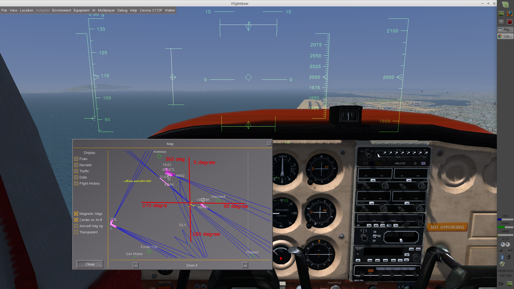
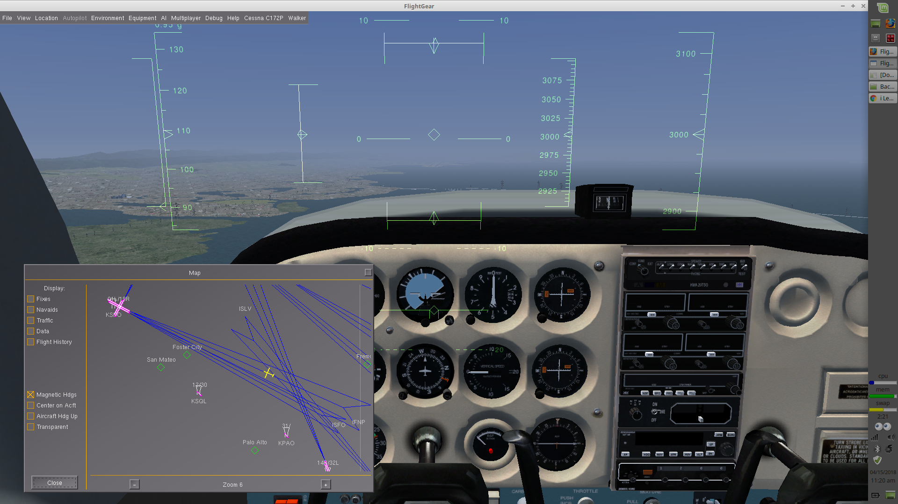
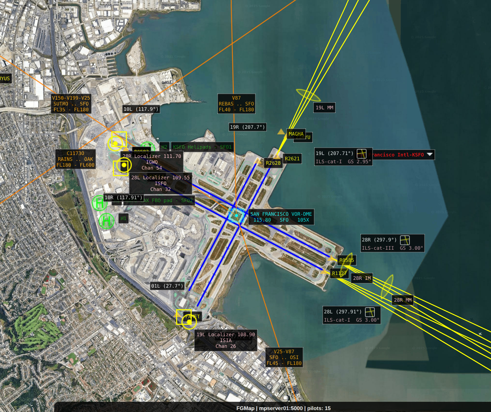
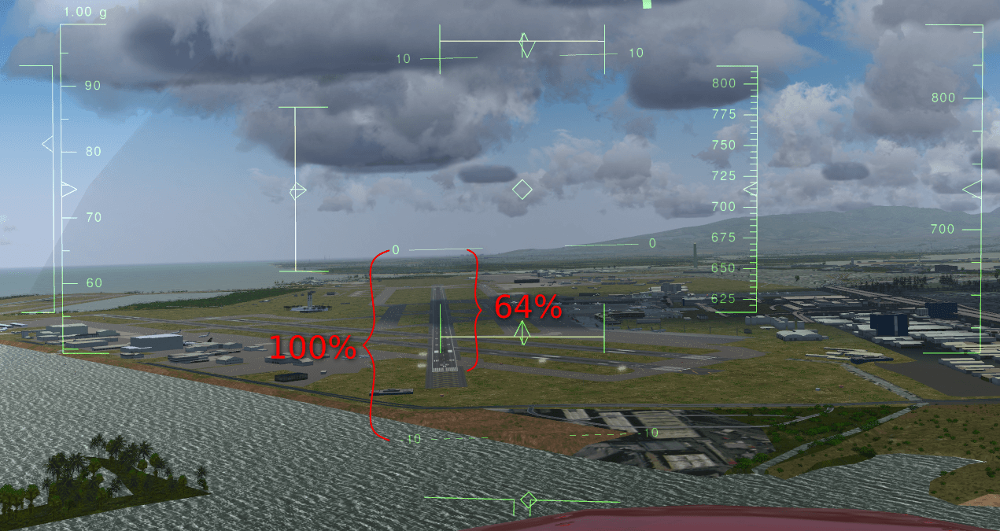
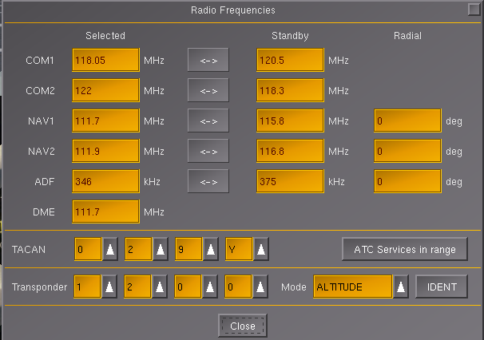
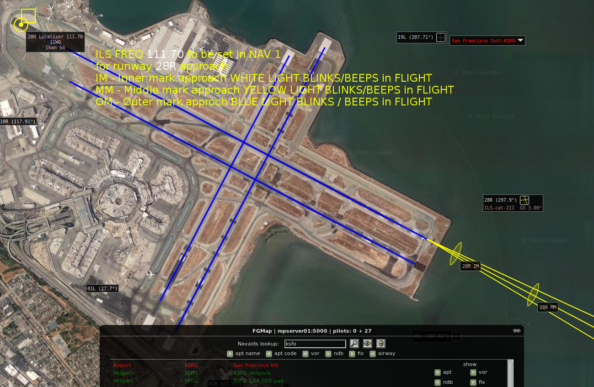

# FlightGear Cessna 172p - ILS Approach Guide

## Table of Contents
1. [Introduction to ILS](#introduction-to-ils)
2. [Understanding ILS Components](#understanding-ils-components)
3. [Finding ILS Frequencies](#finding-ils-frequencies)
4. [ILS Instruments](#ils-instruments)
5. [Setting Up for an ILS Approach](#setting-up-for-an-ils-approach)
6. [Flying the ILS Approach](#flying-the-ils-approach)
7. [Angle of Attack (AoA) for Approaches](#angle-of-attack-aoa-for-approaches)
8. [Common ILS Approaches](#common-ils-approaches)
9. [Troubleshooting](#troubleshooting)
10. [Practice Exercises](#practice-exercises)

---

## Introduction to ILS

**ILS (Instrument Landing System)** is a precision approach system that provides both lateral (left/right) and vertical (up/down) guidance to pilots during approach and landing.

### Key Differences

| System | Coverage | Purpose |
|---|---|---|
| **VOR** | Entire airport area | General navigation |
| **Localizer (LOC)** | Specific runway, specific direction | Runway alignment |
| **ILS** | Localizer + Glideslope | Complete approach guidance |

**Important**:
- One runway has **2 different runway numbers** for each direction of approach
- Each direction has its **own ILS frequency**
- Example: Runway 28L/10R
  - Approach from east (landing 28L): One ILS frequency
  - Approach from west (landing 10R): Different ILS frequency

---

## Understanding ILS Components

### The ILS System

ILS consists of **two parts**:

#### 1. Localizer (LOC)
- **Imaginary beam** along runway centerline
- Extends outward from runway (minimum 10 miles, often 15-20 miles)
- Provides **left/right guidance**
- Displayed on **vertical needle** (CDI) on VOR indicator

#### 2. Glideslope (GS)
- **Imaginary line** extending from runway touchdown point
- Typically at **3° angle** (some airports may vary)
- Provides **up/down guidance**
- Displayed on **horizontal needle** (GSI) on VOR indicator

### How ILS Works

```
Side View (Glideslope):

    -----Aircraft----- (Above glideslope)
         /
        / 3° Glideslope
       /
      /
Runway Touchdown →

Top View (Localizer):

    Aircraft
       ↓
       |  Localizer Centerline
       |
       |
    Runway
```


*ILS approach showing localizer and glideslope guidance*

---

## Finding ILS Frequencies

### Method 1: Using Multiplayer Map Server

1. Open http://mpmap02.flightgear.org/
2. Click **NAV** tab at bottom
3. Search for airport (e.g., **KSFO**)
4. Click on result to open airport
5. Clear 'Navaids lookup:' text box
6. Click **EYE icon** to view all details
7. Click **Dropdown arrow** next to airport name
8. Find ILS frequencies listed by runway

### Method 2: In-Game Map

1. Press **Ctrl + M** to open map
2. Zoom into airport
3. Click on airport
4. View approach information

### Method 3: Real-World Charts

- **SkyVector**: https://skyvector.com/
- **AirNav**: https://www.airnav.com/
- Real-world approach plates

---

## ILS Instruments

### VOR Indicator (Modified for ILS)

When tuned to ILS frequency, the VOR indicator shows:

**Vertical Needle (Localizer - CDI)**:
- Shows deviation from runway centerline
- **Needle left**: Turn left to center
- **Needle right**: Turn right to center
- **Centered**: On runway centerline
- **Sensitivity**: Each dot = ~1° near runway (more sensitive than VOR)

**Horizontal Needle (Glideslope - GSI)**:
- Shows deviation from glideslope
- **Needle above center**: You're below glideslope - climb
- **Needle below center**: You're above glideslope - descend
- **Centered**: On glideslope
- **One dot**: ~0.7° deviation

**TO/FROM Flag**:
- Usually blanks during ILS approach (not used)

**OBS (Omni-Bearing Selector)**:
- **Not used** during ILS approach
- Localizer always shows deviation from runway heading
- Can set to runway heading for reference

### Additional Instruments

**Glide Slope Tunnel** (Optional Visual Aid):
- Enable: **View → Toggle Glide Slope Tunnel**
- Shows tunnel visualization of glideslope
- Helpful for learning

**Marker Pins**:
- Enable: **View → View Options → Show Marker Pins**
- Shows beam of light at each airport
- Helps locate destination from distance

---

## Setting Up for an ILS Approach

### Pre-Flight Setup (Launcher)

**Recommended Settings**:
```bash
--aircraft=c172p --timeofday=noon --enable-hud --httpd=8080 \
--altitude=3000 --heading=294 --vc=110 \
--vor=SFO --offset-distance=12 --offset-azimuth=294 \
--nav1=111.70
```

**Breakdown**:
- Start at 3000 ft, 12 NM from SFO VOR
- Heading 294° (aligned for runway 28R)
- 110 knots airspeed
- NAV1 tuned to 111.70 (KSFO Runway 28R ILS)


*Proper positioning for ILS approach - aircraft should be right and below from runway perspective*

### Aircraft Options

**Enable**:
- ✓ Start with Engine Running
- ✓ Toggle Glide Slope Tunnel


*Visual glide slope tunnel helps with learning ILS approaches*

**Disable**:
- ✗ Enable Damage

**Alternative** (Additional Settings):
```bash
--prop:/sim/crash/detect=false
--prop:/sim/abuse=false
--disable-real-weather-fetch
```

### Radio Setup

**Example: KSFO Runway 28R Approach**

**NAV1 (Primary)**:
- **Standby**: 115.80 (SFO VOR)
- **Active**: 111.70 (KSFO Runway 28R ILS)
- **Volume**: FULL
- **Audio Panel**: NAV1 speaker ON

**NAV2 (Backup/Monitoring)**:
- **Standby**: 116.80 (OAK VOR)
- **Active**: 115.80 (SFO VOR)

**COM1**:
- **Active**: 125.20 (KSFO ATIS)
- **Volume**: FULL
- **Audio Panel**: COM1 speaker ON

### Map Setup

1. Press **Ctrl + M** to open map
2. Ensure correct VOR frequency selected (use swap button)
3. Adjust OBS to align cyan line from VOR to aircraft (for VOR navigation to initial approach fix)
4. Once established on approach, swap to ILS frequency

---

## Flying the ILS Approach

### Step-by-Step ILS Approach Procedure

#### Phase 1: Initial Approach (Tune and Identify)

**1. Tune Frequencies**
- Press **F12** to open Radio Frequencies dialog
- Set **NAV1** to ILS frequency (e.g., 111.70 for KSFO 28R)
- Ensure **volume is FULL**
- Turn on **NAV1 speaker** in Audio Panel

**2. Identify Signal**
- Listen for Morse code identifier
- **Before tuning**: VOR shows "NAV" in RED, CDI vertical (no signal)
- **After tuning**: CDI moves, signal received

**3. Initial Navigation (if using VOR to get to approach)**
- Use VOR frequency first (e.g., 115.80 SFO VOR)
- Adjust OBS to bearing TO the airport
- Follow VOR guidance to initial approach area
- Once near airport, swap to ILS frequency

#### Phase 2: Localizer Intercept (3000-2000 ft)

**1. Altitude and Speed**
- **Altitude**: 2500-3000 ft
- **Speed**: 100-110 knots
- **Power**: Reduce to ~1500-1700 RPM for level flight

**2. Heading**
- Fly heading to intercept localizer at 30-45° angle
- Example: Runway 28R (282°), intercept heading ~320°

**3. Watch CDI (Vertical Needle)**
- Starts deflected (left or right)
- Begins moving toward center as you approach localizer
- **When 1-2 dots from center**: Begin turn to runway heading

**4. Intercept Turn**
- Turn to runway heading (e.g., 282° for runway 28R)
- Small heading adjustments to center needle
- **Goal**: CDI centered, heading matches runway

**5. Track Localizer**
- **CDI centered**: On centerline
- **CDI right**: Turn right to correct
- **CDI left**: Turn left to correct
- **Corrections**: ±5° heading changes

#### Phase 3: Glideslope Intercept (2000-1500 ft)

**1. Watch GSI (Horizontal Needle)**
- Initially above center (you're below glideslope)
- Begins moving down toward center as you approach glideslope

**2. When GSI Approaches Center**
- Reduce power to ~1500 RPM
- Begin descent
- **Target**: 500-700 fpm descent rate

**3. Deploy Flaps (Below 115 knots)**
- First flap: **]** key
- Reduces speed, increases drag
- Re-trim for descent

**4. Track Glideslope**
- **GSI centered**: On glideslope ✓
- **GSI above center**: Too low - add power, raise nose slightly
- **GSI below center**: Too high - reduce power, lower nose slightly

#### Phase 4: Final Approach (1500 ft to Runway)

**1. Speed Control (1500-1000 ft)**
- **Target**: 70-75 knots
- **Pitch controls speed**:
  - Too fast: Raise nose
  - Too slow: Lower nose
- **Trim** to relieve control pressure

**2. Glideslope Control**
- **Throttle controls descent rate**:
  - Too high: Reduce power
  - Too low: Add power
- Keep **GSI centered**

**3. Localizer Tracking**
- Keep **CDI centered**
- Small heading corrections
- Aircraft should align with runway visually

**4. Second Flap (1000 ft)**
- Press **]** for second flap
- Adjust power to maintain glideslope
- Re-trim

**5. Final Flap (500 ft)**
- Press **]** for third/final flap
- **Be ready to add power**
- Maintain 65-70 knots

**6. Visual Landing (Below 500 ft)**
- **Transition to visual references**
- Use runway visual cues
- Follow normal landing procedure:
  - Round-out over runway
  - Flare
  - Touchdown at 55 knots
  - Nose wheel down at 40 knots
  - Brakes below 30 knots

---

## Angle of Attack (AoA) for Approaches

### Understanding AoA on Approach

For jet aircraft (and applicable concepts for all aircraft):

**Target AoA**: **2.5°** (up to 3°) for approach

### Using HUD for AoA Measurement

The HUD (Heads-Up Display) shows precise angle measurements:

**Horizon Lines (HUD)**:
- **0** lines: Ideal horizon (where you look horizontally)
- **-10** lines: 10° below horizon
- Objects at -10 line require you to lower eyes 10° from horizon

**Measuring Descent Angle**:
1. Enable HUD: Press **h**
2. Observe runway threshold position relative to horizon lines
3. **Target**: Runway threshold at 25% toward -10 line (2.5°)
4. **If at 64% toward -10 line**: Too steep (6.4° - too much!)


*HUD showing horizon lines for angle measurement - maintain 2.5° approach angle*

**Adjusting Descent Angle**:
- **Angle >2.5°**: You're above desired path
  - Reduce power
  - Lower nose slightly
- **Angle <2.5°**: You're below desired path
  - Add power
  - Raise nose slightly

**Key Concept**: Keep measuring the angle - it should stay constant at 2.5°

### Visual Cues (Without HUD)

- **Aiming point stationary**: Correct descent angle
- **Aiming point moving up**: Too steep descent
- **Aiming point moving down**: Too shallow descent

---

## Common ILS Approaches

### San Francisco Bay Area


*Quick reference for common Bay Area ILS frequencies*

#### KSFO Runway 28R
**ILS Frequency**: 111.70
**VOR Frequency**: 115.80 (SFO)
**Setup**:
```bash
--aircraft=c172p --timeofday=noon --enable-hud --httpd=8080 \
--altitude=3000 --heading=294 --vc=110 \
--vor=SFO --offset-distance=12 --offset-azimuth=294 \
--nav1=111.70
```

#### KSFO Runway 28L
**ILS Frequency**: 111.30
**VOR Frequency**: 115.80 (SFO)

#### KOAK (Oakland) Runway 28R
**ILS Frequency**: 111.90
**VOR Frequency**: 116.80 (OAK)
**Setup**:
```bash
--aircraft=c172p --timeofday=noon --enable-hud \
--altitude=2000 --heading=300 --vc=110 \
--vor=OAK --offset-distance=5 --offset-azimuth=320 \
--nav1=111.90 --nav2=116.80
```


*Oakland International Airport (KOAK) runway and approach information*

#### KOAK Runway 28L
**ILS Frequency**: 109.70

#### KSJC (San Jose) Runway 30L
**ILS Frequency**: 111.10
**VOR Frequency**: 114.10 (SJC)

---

## Troubleshooting

### Localizer Not Responding

❌ **Problem**: CDI (vertical needle) not moving or stuck
**Solutions**:
- ✓ Check correct ILS frequency tuned (not VOR frequency)
- ✓ Verify NAV1 volume is full
- ✓ Ensure NAV1 speaker ON in audio panel
- ✓ Confirm you're within range (~15-20 miles)
- ✓ Listen for Morse code identifier

### Glideslope Not Showing

❌ **Problem**: GSI (horizontal needle) not responding
**Solutions**:
- ✓ Verify you're tuned to full ILS (not just LOC)
- ✓ Check altitude - must be at or below glideslope intercept altitude
- ✓ Ensure you're on or near localizer (CDI centered)
- ✓ Some ILSs have limited glideslope range - get closer

### Can't Center Needles

❌ **Problem**: CDI or GSI won't center
**Solutions**:
- ✓ CDI: Make larger heading corrections (up to ±10°)
- ✓ GSI: Make larger power adjustments (±100 RPM)
- ✓ Don't chase the needles - make corrections and wait
- ✓ Ensure aircraft is in correct position for intercept

### Needles Too Sensitive

❌ **Problem**: Needles moving erratically, hard to track
**Solutions**:
- ✓ **Normal close to runway** - ILS gets more sensitive
- ✓ Make **smaller, more frequent** heading/power corrections
- ✓ Use **trim** to stabilize aircraft
- ✓ Reduce workload: Pre-configure flaps, speed stabilized

### Wrong Runway Alignment

❌ **Problem**: Localizer tracking but not aligned with intended runway
**Solutions**:
- ✓ Verify correct ILS frequency (each runway direction has different frequency)
- ✓ Check runway number vs. heading (runway 28 ≈ 280°)
- ✓ Confirm you're tracking correct parallel runway (L vs R)

---

## Practice Exercises

### Exercise 1: Localizer-Only Approach

**Objective**: Track localizer without glideslope

1. Set up at 3000 ft, 10 NM from airport
2. Tune ILS frequency
3. Intercept and track localizer
4. **Ignore glideslope** - maintain constant altitude (2500 ft)
5. Practice keeping CDI centered
6. Go around or land

**Success Criteria**: CDI stays within ±1 dot

### Exercise 2: Full ILS to Minimums

**Objective**: Complete ILS approach to decision height

1. Set up at 3000 ft, 12 NM from airport
2. Intercept localizer
3. Intercept glideslope
4. Track both to 500 ft
5. Go around at 500 ft (missed approach)

**Success Criteria**:
- Both needles stay within ±1 dot
- Stabilized descent rate
- Proper speed control

### Exercise 3: ILS to Landing

**Objective**: Complete full ILS approach and landing

1. Set up for ILS approach
2. Track localizer and glideslope
3. Transition to visual at 500 ft
4. Land normally

**Success Criteria**:
- Smooth transition to visual
- Land on centerline
- Touchdown in first 1/3 of runway

### Exercise 4: ILS in Poor Visibility

**Objective**: Practice ILS in low visibility conditions

1. Set weather to overcast/fog
2. Fly complete ILS approach
3. Stay on instruments until runway visible
4. Complete landing

**Success Criteria**:
- Maintain instrument scan
- Smooth transition to visual
- Safe landing

### Exercise 5: Missed Approach

**Objective**: Execute missed approach procedure

1. Fly ILS approach normally
2. At decision height (500 ft AGL), go around:
   - Add **full power**
   - Retract **one flap**
   - Pitch for **positive rate of climb**
   - Retract remaining flaps gradually
3. Climb to pattern altitude
4. Re-enter pattern or set up for another approach

---

## Quick Reference

### ILS Approach Checklist

```
□ NAV1 tuned to ILS frequency
□ Volume FULL, speaker ON
□ Identifier confirmed (Morse code)
□ Altitude: 2500-3000 ft
□ Speed: 100-110 knots
□ Intercept heading set (30-45° to runway)

LOCALIZER INTERCEPT:
□ CDI moving toward center
□ Turn to runway heading when 1-2 dots from center
□ Track localizer (CDI centered)

GLIDESLOPE INTERCEPT:
□ GSI moving toward center
□ Reduce power, begin descent when GSI near center
□ Apply first flap (below 115 kt)
□ Track glideslope (GSI centered)

FINAL APPROACH:
□ Speed: 70-75 kt
□ Second flap at 1000 ft
□ Final flap at 500 ft
□ Both needles centered
□ Transition to visual below 500 ft
□ Normal landing procedure

LANDING:
□ Round-out
□ Flare
□ Touchdown 55 kt
□ Nose wheel down 40 kt
□ Brakes below 30 kt
```

---

## Additional Resources

- **ILS Tutorial**: https://forum.flightgear.org/viewtopic.php?f=2&t=7023
- **Starting in Air**: http://wiki.flightgear.org/Starting_in_the_Air
- **Jet Landing Guide**: https://flightgear.sourceforge.net/manual/2020.3/en/getstart-ench8.html (Section 8.12.3)
- **FAA Instrument Flying Handbook**: Chapter 9

---

**Document Version**: 1.0
**Last Updated**: January 25, 2026
**Aircraft**: Cessna 172p
**Flight Simulator**: FlightGear
