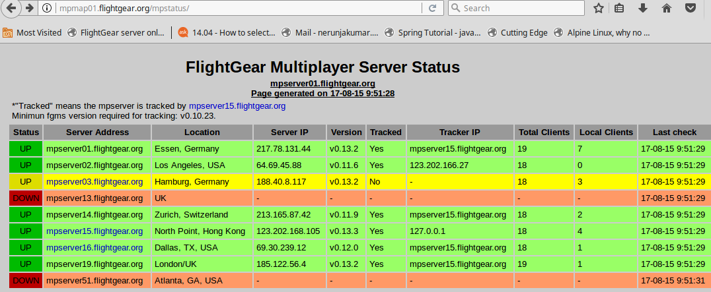
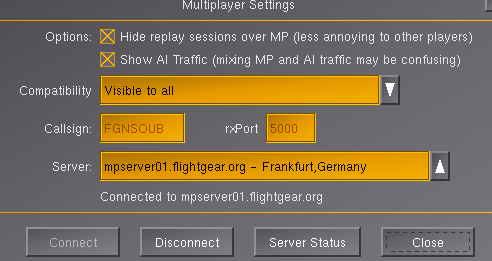
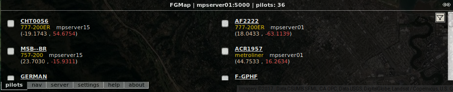
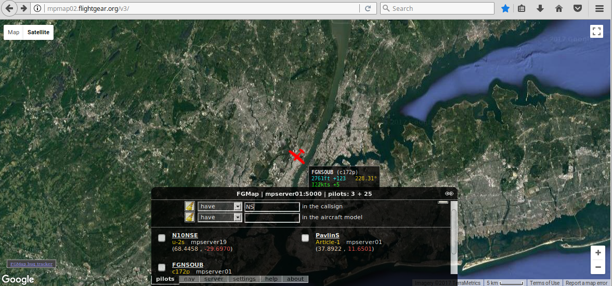

# FlightGear - Multiplayer Mode Guide

## Table of Contents
1. [Introduction](#introduction)
2. [Connecting to Multiplayer](#connecting-to-multiplayer)
3. [Using the Multiplayer Map](#using-the-multiplayer-map)
4. [Finding Your Aircraft](#finding-your-aircraft)
5. [Viewing Other Pilots](#viewing-other-pilots)
6. [Best Practices](#best-practices)
7. [Troubleshooting](#troubleshooting)

---

## Introduction

FlightGear's multiplayer mode allows you to fly with other pilots in real-time. You can see other aircraft, practice formation flying, or simply enjoy the shared experience of virtual aviation.

### What You Can Do in Multiplayer

✓ See other players' aircraft in real-time
✓ Communicate via text chat
✓ Practice formation flying
✓ Share the airspace with real pilots
✓ Track aircraft on multiplayer map
✓ Coordinate group flights

---

## Connecting to Multiplayer

### Step 1: Open Multiplayer Settings

**In FlightGear Launcher**:
1. Launch FlightGear (don't start flying yet)
2. Go to **Multiplayer** → **Multiplayer Settings**

**Or in-game**:
1. Press **F10** (Menu)
2. **Multiplayer** → **Multiplayer Settings**

### Step 2: Configure Connection

**Callsign**:
- Enter your desired callsign/pilot name
- Example: **FGNSOUB**
- This is how other players will see you
- Choose something unique and appropriate

**Server Selection**:
1. Click on server list dropdown
2. Select a server (choose one with low ping and available slots)
3. Common servers:
   - mpserver01.flightgear.org
   - mpserver02.flightgear.org
   - mpserver03.flightgear.org
   - ... etc.


*Multiplayer server selection screen*

### Step 3: Connect

1. Click **Connect** button
2. Wait for connection confirmation
3. Message should appear: "Connected to multiplayer server"

**Note**: The server you choose in FlightGear doesn't need to match the server shown in the online map - all servers share aircraft positions.

### Step 4: Check Server Status

**Before Connecting**:
- Click **Server Status** button, or
- Visit: http://mpmap01.flightgear.org/mpstatus/

**Server Info Shows**:
- Online/Offline status
- Number of connected pilots
- Server load
- Ping time

---

## Using the Multiplayer Map

### Multiplayer Map Overview

The multiplayer map shows all connected aircraft in real-time on a web-based map.

**Map URL**: http://mpmap02.flightgear.org/v3/

### Opening the Map

**Option 1: On Same Computer**
1. Start FlightGear and connect to multiplayer
2. **Takeoff** (ensure flight is running)
3. Open web browser
4. Navigate to: http://mpmap02.flightgear.org/v3/

**Option 2: On Separate Device (Recommended)**
- Open map on **another laptop/mobile device**
- Provides dedicated screen for navigation
- No need to switch windows during flight

### Why Flight Must Be Running

**Important**: Your aircraft only appears on the multiplayer map while the flight is **running** (not paused).

**If You Need to Pause**:
1. Press **Shift + A** multiple times
2. This reduces speed by half for each press
3. Flight stays "running" mode, just very slow
4. Aircraft still appears on map for searching

---

## Finding Your Aircraft

### Step 1: Open Multiplayer Map

Navigate to: http://mpmap02.flightgear.org/v3/

### Step 2: Access Pilots Tab

1. Click **Pilots** tab at the bottom of map
2. List of all connected pilots appears

### Step 3: Search for Your Callsign

1. Click **Funnel icon** (filter) at right corner
2. Enter your callsign (e.g., **FGNSOUB**)
3. Press Enter or click search


*Searching for your callsign in the Pilots tab*

### Step 4: Locate Your Aircraft

1. Your callsign appears in results
2. Click on your callsign
3. Map zooms to your aircraft location
4. Aircraft icon appears on map


*Pilot details and aircraft information*

### Step 5: Monitor Your Flight

**Map shows**:
- Your current position
- Heading
- Altitude
- Speed
- Aircraft type
- Trail of your flight path


*Real-time multiplayer map showing aircraft positions*

---

## Viewing Other Pilots

### Finding Other Aircraft

**Method 1: Pilots Tab**
1. Click **Pilots** tab
2. Browse list of all connected pilots
3. Click on any pilot to view their aircraft

**Method 2: Map View**
1. Zoom out on map
2. Aircraft icons visible across the map
3. Click any aircraft icon for details

**Method 3: Search by Aircraft Type**
1. Use filter/search function
2. Search for specific aircraft models
3. Example: Search "c172p" to find other Cessna 172s

### Aircraft Information Display

Clicking an aircraft shows:
- **Callsign**: Pilot's name
- **Aircraft**: Model type
- **Altitude**: Current altitude
- **Speed**: Current speed
- **Heading**: Direction of flight
- **Position**: Lat/Lon coordinates

### Following Other Aircraft

1. Click on aircraft
2. Map centers on that aircraft
3. Watch their flight path
4. See updates in real-time

---

## Multiplayer Navigation Example

### Scenario: Navigate from KHAF to KSFO with Map Tracking

#### Step 1: Setup

1. **Start FlightGear**:
   ```bash
   --aircraft=c172p --airport=KHAF --timeofday=noon
   ```

2. **Configure Multiplayer**:
   - Callsign: **FGNSOUB**
   - Server: Any available server
   - Click **Connect**

3. **Open Map** (separate device):
   - URL: http://mpmap02.flightgear.org/v3/

#### Step 2: Takeoff and Find Yourself

1. **Takeoff** from KHAF runway 30
2. **In browser** (map):
   - Click **Pilots** tab
   - Search for **FGNSOUB**
   - Click your callsign
   - Map shows your position

#### Step 3: Navigate Using Map

1. **Observe** your position on map
2. **Note** KSFO airport location on map
3. **Calculate** heading from map
4. **In FlightGear**:
   - Set heading to KSFO
   - Use autopilot or manual flight

#### Step 4: Monitor Progress

1. **Watch map** as you fly
2. **Track** your progress toward KSFO
3. **Adjust** heading as needed
4. **Approach** and land at KSFO

---

## Best Practices

### Multiplayer Etiquette

✓ **Choose Appropriate Callsign**:
- Avoid offensive names
- Use realistic callsigns if possible
- Example: N12345, BAW123, YOUR_NAME

✓ **Respect Other Pilots**:
- Maintain safe distances
- Follow traffic patterns at busy airports
- Coordinate on shared frequencies

✓ **Use Chat Responsibly**:
- Be courteous and helpful
- Keep chat relevant to flying
- Help new pilots

✓ **Fly Realistically**:
- Follow proper procedures
- Respect controlled airspace
- Fly safely around other aircraft

### Safety Tips

1. **Avoid Collisions**:
   - Keep visual lookout
   - Use multiplayer map to track nearby aircraft
   - Maintain standard traffic patterns

2. **Busy Airports**:
   - Coordinate takeoffs and landings
   - Use pattern entries properly
   - Announce positions in chat

3. **Formation Flying**:
   - Only with coordination
   - Maintain safe distances
   - Establish lead/wingman roles

### Performance Considerations

**Lower Settings if Needed**:
- Multiplayer requires more processing
- Reduce rendering distance if laggy
- Disable 3D clouds if needed
- Lower traffic density settings

---

## Troubleshooting

### Can't Connect to Server

❌ **Problem**: Connection fails
**Solutions**:
- ✓ Check internet connection
- ✓ Try different server
- ✓ Check firewall settings
- ✓ Verify server status online
- ✓ Restart FlightGear

### Aircraft Not Appearing on Map

❌ **Problem**: Can't find your callsign on map
**Solutions**:
- ✓ **Ensure flight is RUNNING** (not paused)
- ✓ Wait 30-60 seconds after connecting
- ✓ Refresh browser page
- ✓ Check callsign spelling
- ✓ Verify you're actually connected (check in-game)

### Other Aircraft Not Visible

❌ **Problem**: Can't see other multiplayer aircraft in sim
**Solutions**:
- ✓ Check multiplayer is enabled
- ✓ Verify connection to server
- ✓ Other aircraft may be far away
- ✓ Increase MP aircraft visibility range (settings)
- ✓ Wait - aircraft may be loading

### Map Shows Wrong Position

❌ **Problem**: Aircraft position incorrect on map
**Solutions**:
- ✓ Refresh browser
- ✓ Wait for position update (every few seconds)
- ✓ Check that FlightGear is running
- ✓ Reconnect to multiplayer server

### Connection Drops

❌ **Problem**: Disconnected during flight
**Solutions**:
- ✓ Check internet connection stability
- ✓ Try server with better ping
- ✓ Reconnect through multiplayer settings
- ✓ Avoid alt-tabbing excessively

---

## Advanced Features

### Using NAV Tab on Map

The multiplayer map also has a **NAV** tab:

1. Click **NAV** tab at bottom
2. Search for airports, VORs, NDBs
3. View frequencies and information
4. Plan routes using map waypoints

**Example**: Find KSFO VOR
1. NAV tab
2. Search "KSFO"
3. Click airport
4. View all navigation aids and frequencies

### Finding Navigation Aids

**For VOR/ILS frequencies**:
1. Go to http://mpmap02.flightgear.org/
2. Click **NAV** tab
3. Search airport code (e.g., KSFO)
4. Click result
5. Clear search box
6. Click **EYE icon** to show all details
7. Click **dropdown** next to airport name
8. View all frequencies for runways and navaids

---

## Multiplayer Events

### Organized Flights

**FlightGear Community Events**:
- Check FlightGear forums for scheduled events
- Group flights to specific destinations
- Formation flying practice
- Air racing events

**Joining Events**:
1. Check event details (time, location, server)
2. Connect to specified server
3. Navigate to event location
4. Follow event coordinator instructions

### Creating Your Own Events

1. Post on FlightGear forums
2. Specify date, time, location
3. Choose meeting airport
4. Coordinate on specific server
5. Use multiplayer chat for communication

---

## Quick Reference

### Multiplayer Quick Start

```
1. Multiplayer → Multiplayer Settings
2. Enter Callsign: [YOUR_NAME]
3. Select Server
4. Click Connect
5. Start Flight (must be running)
6. Open http://mpmap02.flightgear.org/v3/
7. Pilots Tab → Search Callsign
8. Click your callsign to track
```

### Map URLs

- **Main Map**: http://mpmap02.flightgear.org/v3/
- **Server Status**: http://mpmap01.flightgear.org/mpstatus/
- **Alternative Map**: http://mpmap01.flightgear.org/

---

## Additional Resources

- **FlightGear Multiplayer Wiki**: https://wiki.flightgear.org/Howto:Multiplayer
- **FlightGear Forums**: https://forum.flightgear.org/
- **Server Status**: http://mpmap01.flightgear.org/mpstatus/

---

**Document Version**: 1.0
**Last Updated**: January 25, 2026
**Flight Simulator**: FlightGear
