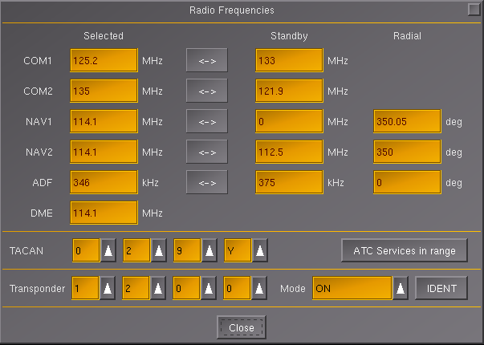
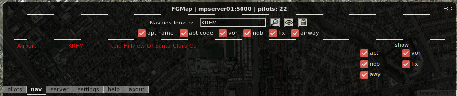
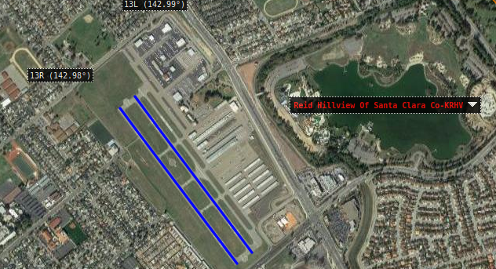
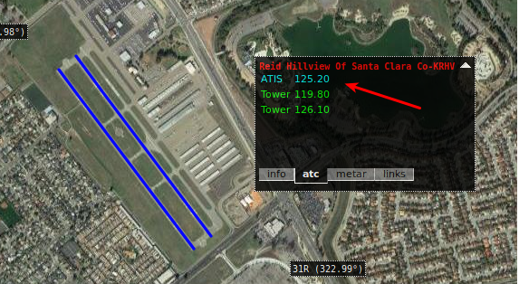
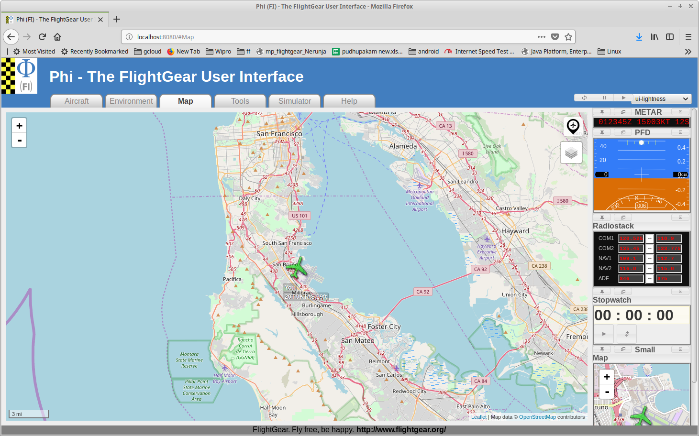
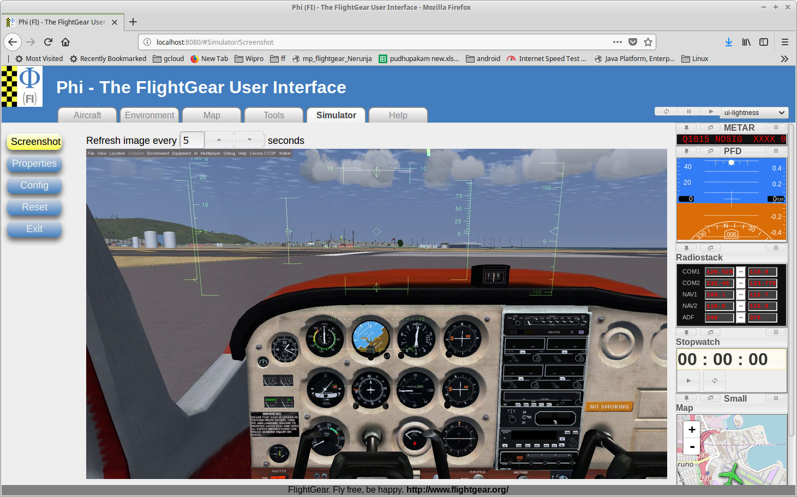
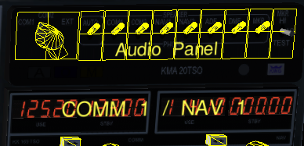

# FlightGear Cessna 172p - Radio Communications and Navigation Aids Reference

## Table of Contents
1. [Radio Systems Overview](#radio-systems-overview)
2. [Navigation Aid Terminology](#navigation-aid-terminology)
3. [ATIS - Automatic Terminal Information Service](#atis---automatic-terminal-information-service)
4. [Finding Radio Frequencies](#finding-radio-frequencies)
5. [Audio Panel Configuration](#audio-panel-configuration)
6. [VOR Station Identification](#vor-station-identification)
7. [Radio Frequency Quick Reference](#radio-frequency-quick-reference)

---

## Radio Systems Overview

### Communication Radios (COM)

The Cessna 172p has two communication radios:

**COM1 (Primary)**:
- Location: Left side of radio stack
- Frequency Range: 118.000 to 136.975 MHz
- Uses: ATIS, Tower, Ground, Approach, Departure

**COM2 (Secondary)**:
- Location: Right side of radio stack
- Frequency Range: 118.000 to 136.975 MHz
- Uses: Backup, additional frequency monitoring

### Navigation Radios (NAV)

The Cessna 172p has two navigation radios:

**NAV1 (Primary)**:
- Location: Left side of radio stack
- Frequency Range: 108.00 to 117.95 MHz
- Uses: VOR, ILS, Localizer navigation

**NAV2 (Secondary)**:
- Location: Right side of radio stack
- Frequency Range: 108.00 to 117.95 MHz
- Uses: Backup navigation, cross-radial fixes

### Opening Radio Panel

**Keyboard**: Press **F12**
**Menu**: F10 → Equipment → Radio Settings


*Radio frequency panel showing COM and NAV radios*

---

## Navigation Aid Terminology

### Ground-Based Systems

| Term | Full Name | Description | Location |
|---|---|---|---|
| **VOR** | VHF Omnidirectional Range | Provides bearing information to aircraft | Ground station at airport |
| **DME** | Distance Measuring Equipment | Provides distance to station | Ground station (often with VOR) |
| **NDB** | Non-Directional Beacon | Low-frequency navigation beacon | Ground station |
| **ILS** | Instrument Landing System | Precision approach guidance | Ground station at runway |
| **LOC** | Localizer | ILS component - lateral guidance | Part of ILS system |
| **GS** | Glide Slope | ILS component - vertical guidance | Part of ILS system |
| **ATIS** | Automatic Terminal Information Service | Continuous weather/airport broadcast | Radio station at airport |

### Aircraft-Based Equipment

| Term | Full Name | Description | Location |
|---|---|---|---|
| **ADF** | Automatic Direction Finder | Points to NDB stations | Onboard aircraft |
| **RDF** | Radio Direction Finder | Manual direction finding | Onboard aircraft |
| **CDI** | Course Deviation Indicator | Vertical needle on VOR display | Instrument panel |
| **GSI** | Glide Slope Indicator | Horizontal needle on VOR display | Instrument panel |
| **OBS** | Omni-Bearing Selector | Knob to select VOR radials | VOR instrument |

### Approach and Procedures

| Term | Full Name | Description |
|---|---|---|
| **VOR-DME** | VOR with Distance Measuring Equipment | Combined VOR and DME at same location |
| **TACAN** | Tactical Air Navigation | Military version of VOR-DME |
| **VORTAC** | VOR + TACAN | Combined civilian and military navaid |
| **IAP** | Initial Approach Procedure | Beginning of instrument approach |
| **IAF** | Initial Approach Fix | First point of approach |
| **FAF** | Final Approach Fix | Final segment before landing |
| **VASI** | Visual Approach Slope Indicator | Visual glideslope guidance lights |
| **PAPI** | Precision Approach Path Indicator | Type of VASI (4 lights) |

### Important Distinction

**ADF vs NDB**:
- **NDB** = Ground station (the beacon)
- **ADF** = Aircraft equipment (the receiver)
- Common mistake: Calling NDB stations "ADF stations" (technically incorrect)

**CDI vs GSI**:
- **CDI** = Vertical needle (left/right guidance)
- **GSI** = Horizontal needle (up/down guidance)

---

## ATIS - Automatic Terminal Information Service

### What is ATIS?

ATIS is a continuous radio broadcast providing:
- Current weather conditions
- Active runways
- Altimeter setting
- NOTAMs (Notices to Airmen)
- Other essential airport information

**Frequency Range**: Usually 118.000-135.975 MHz (COM frequencies)

### Why Listen to ATIS?

**Before Flight**:
1. ✓ Get current weather
2. ✓ Know active runway
3. ✓ Set altimeter correctly
4. ✓ Check any airport notices

**For Realism**:
- Real pilots always listen to ATIS before departure/arrival
- Helps with flight planning
- Keeps you informed of conditions

### How to Use ATIS

#### Step 1: Find ATIS Frequency

**Method 1: Multiplayer Map**
1. Open http://mpmap02.flightgear.org/
2. Click **NAV** tab
3. Search airport code (e.g., **KRHV**)


*Searching for airport in NAV tab*

4. Click result
5. Clear search box
6. Click **EYE icon**


*Airport details with eye icon visible*

7. Click **dropdown arrow** next to airport name


*Complete list of airport frequencies including ATIS*

8. Find ATIS frequency listed

**Method 2: In-Game Map**
1. Press **Ctrl + M**
2. Click airport
3. View frequency information

**Method 3: Real Charts**
- SkyVector.com
- AirNav.com
- Official airport diagrams

#### Step 2: Tune COM Radio

1. Press **F12** to open Radio Frequencies dialog
2. Set **COM1** to ATIS frequency
   - Example: **125.20** for KRHV
3. Ensure **COM1 volume is FULL**

#### Step 3: Enable Audio

1. Locate **Audio Panel** (top of instrument panel)
2. Ensure **COM1 switch is ON**
3. Speaker should be enabled for COM1

**Tip**: Mouse over switches to see labels

#### Step 4: Listen

- ATIS broadcasts continuously
- Repeats every minute or so
- Listen for:
  - **Airport name**
  - **Time**
  - **Weather** (wind, visibility, ceiling)
  - **Temperature/Dewpoint**
  - **Altimeter setting** (important!)
  - **Active runways**
  - **Remarks/NOTAMs**

### Example ATIS Information

**Typical ATIS Broadcast**:
```
"Reid-Hillview Airport information Alpha.
Time 1345 Zulu.
Wind 280 at 8 knots.
Visibility 10 miles.
Sky clear.
Temperature 18, Dewpoint 10.
Altimeter 30.12.
Landing and departing runway 31 Right.
Advise you have Alpha."
```

**What to Note**:
- **Information**: Alpha (changes each update)
- **Wind**: 280° at 8 knots
- **Altimeter**: 30.12 in. Hg (set this on altimeter!)
- **Active Runway**: 31R
- **Weather**: Clear, 10 miles visibility

---

## Finding Radio Frequencies

### Using Multiplayer Map (Detailed)

This is the most comprehensive method for finding all frequencies.

#### For ATIS, VOR, ILS Frequencies

1. **Open Map**: http://mpmap02.flightgear.org/


*FlightGear multiplayer map browser showing NAV tab*

2. **Click NAV Tab** at bottom

3. **Search Airport** (e.g., KRHV - Reid-Hillview)

4. **Click Result** - Map zooms to airport

5. **Clear Search Box** (important!)

6. **Click EYE Icon** - Shows all navaids


*Detailed view showing navigation aids and frequencies*

7. **Click Dropdown Arrow** next to red airport name

8. **View All Frequencies**:
   - **ATIS**: Communication frequency
   - **VOR**: Navigation frequency (if VOR at airport)
   - **ILS/LOC**: Per runway, per direction
   - **Tower**: Air traffic control
   - **Ground**: Ground control

### Example: Finding KRHV Frequencies

Following above steps for KRHV shows:

**KRHV (Reid-Hillview of Santa Clara County)**:
- **ATIS**: 125.20 MHz
- **VOR**: 114.10 MHz (Identifier: RHV)
- **Tower**: (check chart)
- **Ground**: (check chart)
- **Runways**: 31L/13R, 31R/13L

### VOR Frequencies (San Francisco Bay Area)

| VOR | ID | Frequency | Location |
|---|---|---|---|
| San Francisco | SFO | 115.80 | KSFO Airport |
| Oakland | OAK | 116.80 | KOAK Airport |
| San Jose | SJC | 114.10 | KSJC Airport |
| Reid-Hillview | RHV | 114.10 | KRHV Airport |

### ILS Frequencies (Common Bay Area Runways)

| Airport | Runway | ILS Frequency |
|---|---|---|
| KSFO | 28L | 111.30 |
| KSFO | 28R | 111.70 |
| KOAK | 28L | 109.70 |
| KOAK | 28R | 111.90 |
| KSJC | 30L | 111.10 |

**Remember**: Each runway direction has its own ILS frequency!

---

## Audio Panel Configuration

### Audio Panel Location

Located at **top of instrument panel** in Cessna 172p.


*Audio panel with COM1, COM2, NAV1, NAV2 speaker switches*

### Switches and Controls

**Speaker Switches** (Enable/Disable Audio):
- **COM1**: Primary communication radio
- **COM2**: Secondary communication radio
- **NAV1**: Primary navigation radio (for Morse ID)
- **NAV2**: Secondary navigation radio

**How to Use**:
1. **Click switch** to toggle ON/OFF
2. **Mouse over** to see label
3. **ON**: Can hear audio from that radio
4. **OFF**: Muted

### Typical Configurations

**For VOR Navigation**:
- ✓ **NAV1 ON**: Hear VOR Morse code identifier
- ✓ **COM1 ON**: Monitor tower/ATIS
- ✗ **NAV2 OFF**: Unless using for cross-check
- ✗ **COM2 OFF**: Unless monitoring second frequency

**For ATIS**:
- ✓ **COM1 ON**: Listen to ATIS broadcast
- ✗ **NAV1 OFF**: (or ON if identifying VOR simultaneously)

**For ILS Approach**:
- ✓ **NAV1 ON**: Identify ILS Morse code
- ✓ **COM1 ON**: Monitor tower
- ✗ **NAV2 OFF**: Unless backup
- ✗ **COM2 OFF**: Unless needed

### Volume Control

Each radio has its own **volume knob**:
- Located on radio panel
- Turn clockwise to increase
- Turn counterclockwise to decrease
- **Set to FULL** for clear audio

**Important**: Both audio panel switch AND volume knob must be set for audio!

---

## VOR Station Identification

### Why Identify VOR Stations?

**Critical Safety Step**:
1. Ensures you're tuned to correct station
2. Verifies station is operational
3. Confirms signal reception
4. Required procedure for IFR flight

**Before Using Any VOR**: Always identify by Morse code!

### How to Identify VOR

#### Step 1: Tune Frequency

1. Press **F12** for radio panel
2. Set **NAV1** to VOR frequency (e.g., 114.10 for RHV)

#### Step 2: Enable Audio

1. Ensure **NAV1 volume is FULL**
2. Turn ON **NAV1 speaker** in Audio Panel

#### Step 3: Listen for Morse Code

**You will hear**: Morse code identifier repeating
- Example RHV VOR: `• - •  • • • •  • • • -`
- R = `• - •`
- H = `• • • •`
- V = `• • • -`

**Before Tuning**: VOR gauge shows "NAV" in RED
**After Tuning**: CDI needle moves, "NAV" disappears or changes

#### Step 4: Verify Identifier

**Compare** Morse code you hear with expected identifier:
- Check chart or map for VOR identifier
- Ensure it matches what you hear

**If Doesn't Match**:
- Wrong frequency tuned
- Wrong station
- Interference - don't use

### Common VOR Identifiers (Bay Area)

| VOR | ID | Morse Code |
|---|---|---|
| SFO | SFO | `• • •  - •  - - -` |
| OAK | OAK | `- - -  • -  - • -` |
| SJC | SJC | `• • •  • - - -  - • -` |
| RHV | RHV | `• - •  • • • •  • • • -` |

### Morse Code Quick Reference

| Letter | Code | Letter | Code |
|---|---|---|---|
| A | • - | N | - • |
| B | - • • • | O | - - - |
| C | - • - • | P | • - - • |
| D | - • • | Q | - - • - |
| E | • | R | • - • |
| F | • • - • | S | • • • |
| G | - - • | T | - |
| H | • • • • | U | • • - |
| I | • • | V | • • • - |
| J | • - - - | W | • - - |
| K | - • - | X | - • • - |
| L | • - • • | Y | - • - - |
| M | - - | Z | - - • • |

**Notation**:
- `•` = Dit (short beep)
- `-` = Dah (long beep)

---

## Radio Frequency Quick Reference

### COM Frequencies (Communication)

**Frequency Range**: 118.000 - 136.975 MHz
**Spacing**: 25 kHz (118.00, 118.025, 118.05, etc.)

**Common Uses**:
- **118.000-121.400**: Air Traffic Control
- **121.500**: Emergency frequency
- **121.600-121.925**: Ground control
- **122.000-122.675**: Flight Service Station (FSS)
- **122.700-122.925**: Unicom (uncontrolled airports)
- **123.000-123.675**: Unicom/Flight test
- **124.000-135.975**: ATC (Tower, Approach, Center)

### NAV Frequencies (Navigation)

**Frequency Range**: 108.00 - 117.95 MHz
**Spacing**: 50 kHz for VOR, 50 kHz for ILS

**Breakdown**:
- **108.00-111.95**: ILS Localizers (odd tenths only: 108.10, 108.30, etc.)
- **112.00-117.95**: VOR stations

**Examples**:
- **111.70**: ILS (even tenth - .70)
- **115.80**: VOR (any tenth)
- **114.10**: VOR

---

## Practical Examples

### Example 1: Setting Up for VOR Navigation (KRHV to KSFO)

**Goal**: Navigate from Reid-Hillview (KRHV) to San Francisco (KSFO) using VOR

**Radio Setup**:

**NAV1** (Primary - Destination):
- **Active**: 115.80 (SFO VOR)
- **Standby**: 111.70 (KSFO Runway 28R ILS)
- **Volume**: FULL
- **Audio Panel**: NAV1 ON

**NAV2** (Backup - Departure):
- **Active**: 114.10 (RHV VOR)
- **Standby**: 116.80 (OAK VOR)

**COM1**:
- **Active**: 125.20 (KRHV ATIS)
- **Standby**: (KSFO ATIS when approaching)

**Procedure**:
1. Listen to KRHV ATIS on COM1
2. Identify SFO VOR on NAV1 (Morse code)
3. Set OBS to bearing TO SFO
4. Track VOR TO SFO
5. Near SFO, swap NAV1 to ILS frequency (111.70)
6. Intercept and fly ILS approach

### Example 2: ILS Approach Setup (KSFO Runway 28R)

**Radio Setup**:

**NAV1**:
- **Active**: 111.70 (KSFO Runway 28R ILS)
- **Volume**: FULL
- **Audio Panel**: NAV1 ON

**NAV2**:
- **Active**: 115.80 (SFO VOR - for backup)
- **Volume**: FULL
- **Audio Panel**: NAV2 ON (optional)

**COM1**:
- **Active**: (KSFO ATIS frequency)
- **Volume**: FULL
- **Audio Panel**: COM1 ON

**Procedure**:
1. Listen to ATIS, note altimeter and active runway
2. Identify ILS on NAV1 (Morse code)
3. Verify runway 28R is active
4. Intercept localizer
5. Track ILS to landing

---

## Additional Resources

- **Multiplayer Map**: http://mpmap02.flightgear.org/
- **SkyVector Charts**: https://skyvector.com/
- **AirNav Airport Info**: https://www.airnav.com/
- **FAA Radio Navigation**: FAA Instrument Flying Handbook, Chapter 9

---

**Document Version**: 1.0
**Last Updated**: January 25, 2026
**Aircraft**: Cessna 172p
**Flight Simulator**: FlightGear
