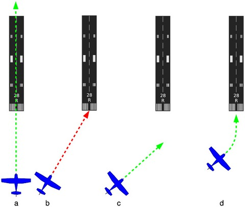

# FlightGear Cessna 172p - Takeoff and Landing Procedures

## Table of Contents
1. [Pre-Flight Preparation](#pre-flight-preparation)
2. [Realistic Takeoff Procedure](#realistic-takeoff-procedure)
3. [Climb and Level-Off](#climb-and-level-off)
4. [Turning in Flight](#turning-in-flight)
5. [Landing Procedure](#landing-procedure)
6. [Landing Alignment](#landing-alignment)
7. [Visual Approach Slope Indicator (VASI)](#visual-approach-slope-indicator-vasi)
8. [Common Mistakes and Tips](#common-mistakes-and-tips)

---

## Pre-Flight Preparation

### Altimeter Setting
Adjust the altimeter to the correct altitude based on airport elevation:
- **KSFO (San Francisco)**: Sea level - 0 ft
- Check airport elevation from ATIS or airport information

### Control Check
1. Press **Tab** to enter mouse control mode
2. Verify aileron and elevator are neutral by observing yoke position
3. Check that the mouse shows a **+** cursor (control mode)

### Engine Start
- **Option 1**: Enable "Start with Engine Running" in Aircraft Options
- **Option 2**: Manual engine start procedure (refer to Cessna 172p checklist)
- **Target**: ~1000 RPM for taxi

---

## Realistic Takeoff Procedure

### General Takeoff Rules

1. **40 knots** - Lift nose wheel from runway
2. **55 knots** - Aircraft will naturally take off
3. **70 knots** - Accelerate immediately to this speed after takeoff (stay above stall speed)
4. **75 knots** - Don't exceed this speed to gain height quickly
5. **500 ft** - Maintain runway heading until this altitude (allows emergency return to runway)
6. **1000 ft** - Safe altitude before overflying buildings
7. **Close to ground** - Keep turns gentle and well-coordinated using rudder

### Step-by-Step Takeoff Using Mouse

**1. Pre-Takeoff Checks**
- Adjust altimeter to airport altitude
- Check aileron and elevator neutral (observe yoke position)
- Ensure Numlock is ON

**2. Control Setup**
- Press **Right Mouse Button** to change to control mode
- **Hold Left Mouse Button** to control rudder (for straight takeoff)

**3. Power Application**
- Apply full power: Hold **PgUp** until throttle is fully in (~1000 RPM or higher)

**4. Takeoff Roll (0-40 knots)**
- Keep aircraft centered on runway using mouse (small rudder adjustments)
- Hold **Left Mouse Button** for rudder control
- Use **comma (,)** and **period (.)** for brake steering if needed at very low speeds

**5. Rotation (40 knots)**
- **Release Left Mouse Button**
- Pull back slightly on mouse to raise nose wheel
- Aircraft is now responding to yoke inputs (mouse movements)

**6. Liftoff (55 knots)**
- Aircraft will naturally fly off the runway at approximately 55 knots
- **Immediately lower nose slightly** to accelerate to 70 knots
- Don't climb too steeply - need to build speed first

**7. Initial Climb (55-75 knots)**
- Keep alignment with runway heading
- Accelerate to 70 knots by lowering nose if needed
- Monitor airspeed indicator (ASI)

**8. Established Climb (70-75 knots)**
- Maintain 70-75 knots using pitch control:
  - **Airspeed dropping**: Lower nose
  - **Airspeed increasing**: Raise nose slightly
- Continue climbing on runway heading

**9. Pattern Altitude (500 ft)**
- Once at 500 feet, safe to turn to required heading
- Stay away from buildings until over 1000 ft
- Keep turns gentle and coordinated

### Speed Control During Climb

**Critical Concept**: You use the **yoke to control speed** during takeoff and climb
- **Nose up** = Less speed, more climb rate
- **Nose down** = More speed, less climb rate
- Target: **70-75 knots** for optimal climb performance

---

## Climb and Level-Off

### Maintaining Climb Speed
- **Target**: 70-75 knots
- **If dropping below 70 knots**: Lower nose slightly
- **If exceeding 75 knots**: Raise nose slightly
- Use pitch (yoke) for speed, power (throttle) for climb rate

### Leveling Off at Cruise Altitude
1. Maintain throttle setting
2. Gradually lower nose as you approach target altitude
3. Allow speed to build to cruise speed (~100-120 knots)
4. Reduce power to cruise setting
5. Trim aircraft to relieve control pressure

### Maintaining Altitude
- **Horizon Reference**: Note where horizon line intersects with nose while level on ground
- Use this as reference for level flight
- Small pitch adjustments to maintain altitude
- Trim aircraft to minimize control inputs

---

## Turning in Flight

### Standard Rate Turn (20° Bank)

**20° bank is ideal** for safe and steady turns in the Cessna 172p:
- More than enough for navigation
- Easy to maintain
- Reduces risk of stall

### Turn Coordinator
- Shows aircraft from behind
- Indicates bank angle
- Wings level = straight flight
- Aircraft tilted = banked turn

### Turn Timing (at 20° Bank)
Regardless of airspeed, at 20° bank:
- **360° turn** = 120 seconds (2 minutes)
- **180° turn** = 60 seconds (1 minute)
- **90° turn** = 30 seconds

This is extremely useful for navigation timing!

### Executing a Turn
1. **Bank** the aircraft left or right (using ailerons/mouse)
2. **Maintain 20° bank** - check turn coordinator or horizon
3. **Apply coordinated rudder** - keep turn coordinated (ball centered)
4. **Maintain altitude** - may need slight back pressure on yoke
5. **Roll out** - return wings level as you approach desired heading

### Observing Ground Features
Try this exercise:
- Maintain 20° bank for a few minutes
- Watch ground features
- Same features reappear every 120 seconds
- Confirms you're in a perfect 360° turn

---

## Landing Procedure

### Landing Rules (Reverse of Takeoff)

1. **Close to ground** - Turns should be gentle and well-coordinated
2. **500 ft minimum** - Until on final approach to runway
3. **70 knots** - Approach speed
4. **55 knots** - Touchdown speed on main wheels
5. **40 knots** - Let nose wheel touch down
6. **30 knots** - Apply brakes

### Aiming Point Technique

**Pick an aiming point** on the runway (e.g., touchdown markers):
- **Aiming point moves upward**: Descending too fast (add power)
- **Aiming point moves downward**: Descending too slowly (reduce power)
- **Aiming point stationary**: Perfect descent rate

### Step-by-Step Straight-In Landing

**1. Initial Approach (1500 ft, few miles out)**
- Line up with runway
- Reduce power to approximately **1500 RPM**
- Begin gradual descent

**2. First Flap Application (Below 115 knots)**
- Apply one step of flaps: Press **]**
- Increases lift but also slows you down
- Re-trim aircraft to maintain descent

**3. Intermediate Approach (1000 ft)**
- Apply second step of flaps: Press **]**
- Significant increase in drag
- Improves view over nose
- Re-trim as needed

**4. Speed Control**
- **Target**: 70 knots
- **Use elevator and trim**:
  - Flying below 70 knots: Push yoke forward
  - Flying above 70 knots: Pull yoke back
  - Use trim to relieve pressure
- **Speed is controlled by pitch, not throttle**

**5. Altitude/Descent Rate Control**
- **Use throttle for altitude control**:
  - Descending too fast: Add power
  - Too high: Reduce power
- **Watch runway numbers**:
  - Moving up screen: Too steep - increase power
  - Moving down screen: Too high - reduce power

**6. Alignment**
- Make minor heading adjustments
- Keep aligned with runway centerline
- Small, smooth corrections

**7. Final Flaps (500 ft)**
- Apply final step of flaps: Press **]**
- Significant drag increase
- **Be prepared to add power** to maintain descent rate
- Target speed: **65-70 knots**

**8. Round-Out (Just Above Runway)**
- Reduce power to **idle**
- Gently pull back on yoke to level aircraft
- Aircraft should fly level a couple feet above runway
- **Critical skill**: Correct round-out height takes practice
- **Tip**: Observe horizon, don't fixate on aiming point

**9. Keep Wings Level**
- Use small yoke inputs
- Both main wheels should touch down simultaneously

**10. Flare (Touchdown)**
- Continue pulling back on yoke
- Main wheels touch at approximately **55 knots**
- **Don't force it down** - let it settle naturally

**11. Touchdown**
- Be ready to use rudder: **Numpad 0 / Enter**
- Keep aircraft straight on centerline
- Let aircraft roll on main wheels

**12. Nose Wheel Down (Below 40 knots)**
- Lower nose wheel to ground
- Continue using rudder for directional control

**13. Ground Roll (Below 40 knots)**
- Switch to rudder control if needed
- Hold **Left Mouse Button** for nose wheel/rudder control

**14. Braking (Below 30 knots)**
- Apply brakes: Press **b** key
- Slow aircraft to taxi speed
- Don't brake too hard - risk of nose-over

**15. Taxi to Parking**
- Release **b** when stopped or very slow
- Add little engine power to taxi
- Use **comma (,)** and **period (.)** for steering

---

## Landing Alignment

### The Problem
Simply aiming at the runway start will lead to misalignment!

### The Solution: Aim Well Ahead

**Visualization**:
```
(a) Correct: Flight direction matches runway centerline ✓
(b) Wrong: Aiming directly at runway start ✗
(c) Correct: Aim at fictitious point well in front of runway ✓
(d) Correct: Begin gentle turn well before reaching that point ✓
```


*Proper landing alignment technique - aim well ahead of runway, not at runway start*

### Alignment Procedure

1. **Pick a fictitious aiming point** well in front of runway (not at runway start)
2. **Fly toward that point** while still far away
3. **Begin gentle turn** toward runway well before reaching the point
4. **Make very soft corrections**:
   - So gentle you won't notice on turn coordinator
   - Rely on outside horizon, not instruments
5. **Final result**: Flight direction matches runway centerline perfectly

### Alignment Corrections
- Turns and banks for alignment are often **very soft**
- You might not even notice them on instruments
- **Trust visual references** (horizon line) over instruments for alignment
- Make corrections **early** - easier than last-minute adjustments

---

## Visual Approach Slope Indicator (VASI)

### Purpose
VASI lights help you maintain the correct descent angle (glide slope) during approach.

### Types of VASI

#### 1. PAPI (Precision Approach Path Indicator)
**4 lights in a row** beside runway:

| Light Configuration | Meaning |
|---|---|
| ⚪⚪⚪⚪ (4 White) | Too High |
| ⚪⚪⚪🔴 (3 White, 1 Red) | Slightly High |
| ⚪⚪🔴🔴 (2 White, 2 Red) | **On Correct Glide Path** ✓ |
| ⚪🔴🔴🔴 (1 White, 3 Red) | Slightly Low |
| 🔴🔴🔴🔴 (4 Red) | Too Low - Danger! |

**Target**: 2 white, 2 red lights

#### 2. Tri-Color VASI
**Single light that changes color**:

| Color | Meaning |
|---|---|
| 🟡 Yellow | Too High |
| 🟢 Green | **On Glide Path** ✓ |
| 🔴 Red | Too Low |

#### 3. PLASI (Pulse Light Approach Slope Indicator)
- **Running lights** from approach path to runway beginning
- Lights appear to "run" down to runway
- Follow the pulse sequence

### Using VASI
1. Identify VASI type on your approach
2. Adjust pitch and power to achieve correct indication
3. **Too high**: Reduce power, lower nose slightly
4. **Too low**: Add power, raise nose slightly
5. Maintain correct indication all the way to runway

---

## Common Mistakes and Tips

### Takeoff Mistakes

❌ **Climbing too steeply at liftoff**
- Results in speed dropping below 70 knots
- Risk of stall
- ✓ Lower nose after liftoff to build speed first

❌ **Turning before 500 ft**
- Risk if engine fails
- Can't glide back to runway
- ✓ Wait until 500 ft before turning

❌ **Not using rudder above 40 knots**
- Poor directional control on takeoff roll
- ✓ Switch from brakes to rudder at 40 knots

❌ **Forgetting to release left mouse at rotation**
- Stuck in rudder control mode
- Can't control pitch
- ✓ Release left mouse at 40 knots for yoke control

### Landing Mistakes

❌ **Flaps deployed above 115 knots**
- Risk of flap damage
- ✓ Slow down first, then deploy flaps

❌ **Trying to hover over runway**
- Wastes runway
- Makes touchdown harder to control
- ✓ Let aircraft settle naturally in flare

❌ **Fixating on aiming point during round-out**
- Harder to judge height
- ✓ Look at horizon during round-out

❌ **Too much brake at high speed**
- Risk of nose-over
- Flat-spotted tires
- ✓ Wait until below 30 knots for braking

❌ **Forcing nose wheel down early**
- Increases wear, poor control
- ✓ Let nose wheel settle naturally below 40 knots

### Pro Tips

✓ **Horizon Reference**: Note horizon level while on ground - use as reference for level flight

✓ **Speed Control**: Pitch (yoke) controls speed, power (throttle) controls climb/descent rate

✓ **Stabilized Approach**: Maintain 70 knots and proper descent rate - makes landing much easier

✓ **Go-Around**: If approach doesn't feel right, add full power and go around - always an option!

✓ **Practice**: Landing is the hardest skill - practice at different airports, weather, and times of day

✓ **Soft Inputs**: Close to ground, all control inputs should be small and gentle

✓ **Energy Management**: Too high = add flaps or reduce power; Too low = add power immediately

---

## Quick Reference Cards

### Takeoff Quick Reference
```
Ground → 1000 RPM → Full Power → Hold Left Mouse
↓
40 knots → Release Left Mouse → Rotate (Nose Up)
↓
55 knots → Liftoff → Lower Nose
↓
70 knots → Climb Speed → Maintain with Pitch
↓
500 ft → Safe to Turn → Climb to Pattern Altitude
```

### Landing Quick Reference
```
1500 ft, Aligned → 1500 RPM → Descend
↓
<115 knots → Flaps 1 (]) → Re-trim
↓
1000 ft → Flaps 2 (]) → 70 knots
↓
500 ft → Flaps 3 (]) → 65-70 knots
↓
Over Runway → Idle Power → Round-Out
↓
Flare → 55 knots → Touchdown Main Wheels
↓
40 knots → Nose Wheel Down → Rudder Control
↓
30 knots → Brakes (b) → Taxi Clear
```

---

## Practice Exercises

### Exercise 1: Pattern Work
1. Takeoff from KSFO runway 28L
2. Climb to 1000 ft on runway heading
3. Turn left to crosswind leg (208°)
4. Turn left to downwind (118°)
5. Turn left to base (028°)
6. Turn left to final (298°)
7. Land on runway 28L

### Exercise 2: Touch and Go
1. Perform normal landing
2. As main wheels touch, add full power
3. Retract flaps to 1 step
4. Takeoff again without stopping
5. Repeat for practice

### Exercise 3: Short Field Takeoff
1. Start at runway beginning
2. Hold brakes, apply full power
3. Release brakes
4. Rotate at 40 knots
5. Climb at Vx (best angle) ~60 knots
6. Clear obstacle, accelerate to Vy (best rate) ~75 knots

### Exercise 4: Short Field Landing
1. Approach at 60 knots (slower than normal)
2. Full flaps
3. Aim for touchdown zone markers
4. Touch down, immediate braking
5. Minimize landing roll

---

## Additional Resources

- **FlightGear Manual**: http://www.flightgear.org/Docs/getstart/getstartch7.html
- **Cessna 172 POH**: Pilot Operating Handbook (search online)
- **YouTube Tutorials**: Search "FlightGear Cessna 172p landing tutorial"

---

**Document Version**: 1.0
**Last Updated**: January 25, 2026
**Aircraft**: Cessna 172p
**Flight Simulator**: FlightGear
