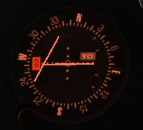
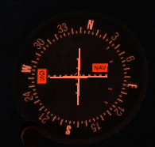
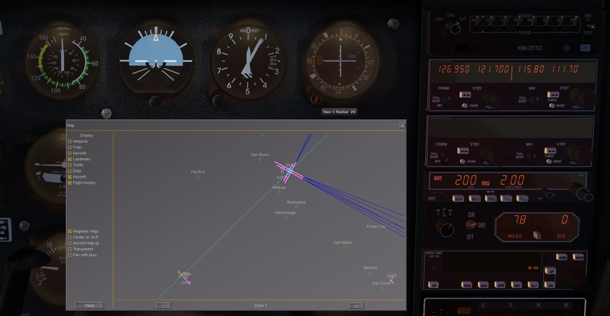
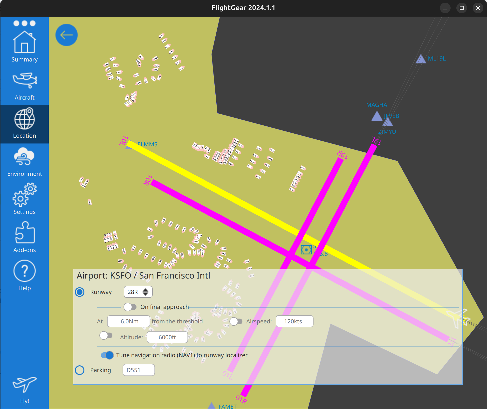

# VOR-DME Flying Guide for FlightGear Cessna 172p

## Table of Contents
1. [Introduction](#introduction)
2. [Understanding VOR-DME](#understanding-vor-dme)
3. [Cessna 172p Navigation Equipment](#cessna-172p-navigation-equipment)
4. [Pre-Flight Setup in FlightGear](#pre-flight-setup-in-flightgear)
5. [Basic VOR Navigation](#basic-vor-navigation)
6. [DME Operation](#dme-operation)
7. [VOR Intercepts and Tracking](#vor-intercepts-and-tracking)
8. [Common VOR-DME Procedures](#common-vor-dme-procedures)
9. [Troubleshooting](#troubleshooting)
10. [Practice Exercises](#practice-exercises)

---

## Introduction

This guide provides a comprehensive overview of VOR-DME navigation using the Cessna 172p aircraft in FlightGear. VOR-DME navigation is a fundamental skill for instrument flying and cross-country navigation.

### What You'll Learn
- How to tune and identify VOR stations
- How to navigate TO and FROM VOR stations
- How to use DME for distance information
- How to perform VOR intercepts and tracking
- Practical navigation procedures

---

## Understanding VOR-DME

### VOR (VHF Omnidirectional Range)

**VOR** is a ground-based radio navigation system that provides azimuth (bearing) information to aircraft. Each VOR station transmits signals that allow aircraft to determine their magnetic bearing TO or FROM the station.

**Key Concepts:**
- **Radials**: Magnetic courses extending FROM a VOR station (000° to 359°)
- **TO/FROM Indicator**: Shows whether the selected course will take you TO or FROM the station
- **CDI (Course Deviation Indicator)**: Shows left/right deviation from the selected course
- **OBS (Omni-Bearing Selector)**: The knob used to select the desired radial/course

### DME (Distance Measuring Equipment)

**DME** provides slant-range distance (in nautical miles) from the aircraft to a DME-equipped ground station. It also typically displays:
- **Distance**: Current distance to the station (NM)
- **Groundspeed**: Calculated groundspeed based on distance changes
- **Time to Station**: Estimated time to reach the station (minutes)

---

## Cessna 172p Navigation Equipment

The FlightGear Cessna 172p is equipped with two navigation radios:

### NAV1 Radio (Primary)
- **Location**: Left side of the radio stack
- **Frequency Range**: 108.00 to 117.95 MHz
- **Controls**:
  - Frequency selector (outer/inner knobs)
  - OBS knob (below the CDI)
  - Volume control
  - Audio identifier switch

### NAV2 Radio (Secondary)
- **Location**: Right side of the radio stack
- **Frequency Range**: 108.00 to 117.95 MHz
- **Controls**: Same as NAV1
- **Use**: Backup navigation, cross-radial fixes, or monitoring approach facilities

### Primary Flight Instruments

**VOR Indicator (CDI - Course Deviation Indicator)**
- **CDI Needle**: Shows deviation from selected course (each dot = 2°)
- **TO/FROM Flag**: Indicates whether the course is TO or FROM the station
- **OBS Window**: Displays the selected course
- **Heading Bug**: Some versions have a heading bug for reference

**DME Display**
- **Distance Reading**: Digital display showing distance in NM
- **Groundspeed**: Current groundspeed
- **Time to Station**: Minutes to reach the station at current speed

---

## Pre-Flight Setup in FlightGear

### Starting FlightGear with Cessna 172p

1. Launch FlightGear
2. Select **Aircraft**: Cessna 172p
3. Select **Airport**: Choose an airport with nearby VOR stations (e.g., KSFO, KJFK, KLAX)
4. Set **Weather** and **Time of Day** as desired
5. Click **Fly**

### Enabling the VOR-DME Display

1. Once in the cockpit, press **F10** to open the menu
2. Navigate to **Equipment** > **Radio Settings**
3. Ensure NAV1 and NAV2 radios are enabled
4. Enable DME if not already active

### Finding VOR Stations

**In-Sim Methods:**
1. Press **F10** → **Equipment** → **Map** to view the navigation map
2. Press **M** key to toggle the map overlay (shows VORs, NDBs, airports)
3. VOR stations are displayed with their identifier and frequency

**Common VOR Identification:**
- VOR stations transmit a 3-letter Morse code identifier
- Listen to the audio identifier to confirm you've tuned the correct station

---

## Basic VOR Navigation

### Step 1: Tune the VOR Station

1. **Find the VOR frequency** (from charts, map, or in-game map)
   - Example: San Francisco VOR (SFO) - 115.80 MHz

2. **Tune NAV1 radio**:
   - Click the outer knob to adjust the whole MHz (115)
   - Click the inner knob to adjust the decimal (.80)
   - Active frequency: 115.80

3. **Identify the station**:
   - Turn up NAV1 volume
   - Listen for the Morse code identifier (e.g., "... ..-. ---" for SFO)
   - Verify it matches the expected station

*VOR indicator after tuning - CDI needle responding, station identified*

### Step 2: Understanding the VOR Display

**Course Deviation Indicator (CDI):**
- **Centered needle**: You're on the selected course
- **Needle deflected LEFT**: The course is to your left; turn left to intercept
- **Needle deflected RIGHT**: The course is to your right; turn right to intercept
- **Each dot**: Represents 2° of deviation (full scale = 10°)

*VOR indicator showing CDI needle, TO/FROM flag, and OBS knob (left side)*

**TO/FROM Indicator:**
- **TO**: Flying the selected course will take you TOWARD the station
- **FROM**: Flying the selected course will take you AWAY FROM the station
- **OFF**: You're near or over the station, or no signal

### Step 3: Select a Course with the OBS

1. **Rotate the OBS knob** to select a course (radial)
2. The **course window** shows the selected magnetic course
3. Try rotating the OBS until:
   - The CDI needle centers
   - The TO/FROM flag shows your desired direction

**Example:**
- If the CDI centers at 270° with a TO indication, you're on the 090° radial (east of the station), and flying 270° would take you TO the station

### Step 4: Tracking a VOR Radial

**To Track TO a Station:**
1. Tune and identify the VOR
2. Rotate OBS to the course you want to fly TO the station
3. Check the TO/FROM indicator shows "TO"
4. Turn the aircraft to the course shown in the OBS window
5. Keep the CDI needle centered by making small heading corrections
   - Needle left → Turn left
   - Needle right → Turn right

**To Track FROM a Station:**
1. Tune and identify the VOR
2. Select the radial you want to track (course FROM the station)
3. Check the TO/FROM indicator shows "FROM"
4. Fly the selected radial, keeping the CDI centered

---

## DME Operation

### Activating DME

1. **Automatic DME**: In most FlightGear setups, DME automatically tunes to the NAV1 frequency if the station has DME capability
2. **DME Display**: Look for the DME readout on the instrument panel (usually near or integrated with the NAV radio)

### Reading DME Information

**Distance (NM):**
- Shows slant-range distance to the station
- Note: At high altitudes or close to the station, slant range differs from ground distance
- Formula: Ground distance ≈ √(Slant range² - Altitude²)

**Groundspeed (KT):**
- Calculated based on the rate of distance change
- Most accurate when flying directly TO or FROM the station

**Time to Station (MIN):**
- Estimated time to reach the station at current groundspeed
- Only accurate when flying directly toward the station

### Practical DME Uses

1. **Position Fixes**: Combine VOR radial with DME distance for precise position
2. **Altitude Planning**: Calculate when to begin descent (e.g., 3° descent = 300 ft per NM × distance)
3. **Holding Patterns**: DME arcs or distance-based holding
4. **Approach Procedures**: Many approaches use DME for stepdown fixes

---

## VOR Intercepts and Tracking

### The 90° Intercept Method

**Scenario**: You want to intercept and track the 360° radial FROM the SFO VOR

1. **Tune and identify** SFO VOR (115.80)
2. **Set OBS to 360°** (the radial you want to track)
3. **Check the TO/FROM**: Should show "FROM" when tracking outbound
4. **Determine your position**:
   - If CDI is deflected right: You're left of the radial
   - If CDI is deflected left: You're right of the radial
5. **Turn to intercept**:
   - Fly a heading 90° to the radial toward the CDI needle
   - Example: If tracking 360° radial and CDI is right, turn to 090° (90° intercept)
6. **Watch the CDI**: As it centers, turn to track the radial (360°)
7. **Make small corrections**: Keep the needle centered with ±5° heading changes

### The 45° Intercept Method

**Use**: When closer to the course or for more gentle intercepts

1. Same setup as 90° intercept
2. Turn to a heading 45° to the desired radial
3. Example: Tracking 360° radial, CDI right → turn to 045°
4. As CDI centers, turn to track 360°

### Station Passage

**Indications:**
1. CDI becomes very sensitive near the station
2. TO/FROM flag flips or shows OFF
3. DME shows minimum distance (often 0.0 to 0.5 NM overhead)
4. CDI may swing to opposite side

**What to do:**
1. Continue on your heading through station passage
2. Once past the station, verify the FROM flag
3. Re-center the CDI with the OBS if needed

---

## Common VOR-DME Procedures

### Cross-Country Navigation

**Planning:**
1. Select VOR stations along your route
2. Note frequencies and radials to/from each station
3. Calculate distances using DME or charts
4. Plan altitudes for obstacle clearance

**En Route:**
1. Tune NAV1 to the next VOR
2. Set OBS to track TO the station
3. Monitor DME for distance
4. Before station passage, prepare the next VOR frequency

### VOR-DME Arc

**Scenario**: Fly a 10 NM arc around a VOR (common in approach procedures)

1. **Tune the VOR** and verify DME is active
2. **Position**: Fly to intercept the desired arc distance (10 NM)
3. **Turn to arc**:
   - Radial + 90° = clockwise arc heading
   - Radial - 90° = counterclockwise arc heading
4. **Monitor DME**:
   - Too close (<10 NM): Turn outbound (away from station)
   - Too far (>10 NM): Turn inbound (toward station)
5. **Update radial**: Every 10-15°, update your heading to maintain the arc

**Example:**
- Arc clockwise at 10 NM around SFO VOR
- At 090° radial: Fly heading 180° (090° + 90°)
- At 120° radial: Fly heading 210° (120° + 90°)
- Keep DME at 10 NM ±0.5

### Position Fix with Cross-Radials

1. **Tune VOR1** on NAV1 and note the radial (center CDI with FROM)
2. **Tune VOR2** on NAV2 and note the radial (center CDI with FROM)
3. **Plot**: Your position is at the intersection of these radials
4. **Add DME**: Use DME from either station to confirm

---

## Troubleshooting

### CDI Not Responding
- Check NAV radio is powered on
- Verify correct frequency is tuned
- Ensure you're within range (~200 NM at altitude, less at low altitude)
- Check audio identifier to confirm station

### TO/FROM Flag Shows OFF
- You're near or over the station (within the cone of confusion)
- Signal is weak or station is out of range
- OBS is set to a perpendicular course (neither TO nor FROM makes sense)

### DME Not Displaying
- Ensure the VOR station has DME capability (not all VORs have DME)
- Check DME is set to NAV1 frequency
- Verify you're within DME range (typically ~199 NM)

### CDI Oscillating or Unstable
- Normal near the station (station passage)
- High winds or turbulence causing drift
- Make smaller, more frequent heading corrections

### Can't Identify Station
- Volume may be too low on NAV radio
- Wrong frequency tuned
- Station may be out of range or out of service

---

## Practice Exercises

### Exercise 1: VOR Orientation

**Objective**: Determine your position relative to a VOR

1. Start at any airport with a nearby VOR (within 30 NM)
2. Tune the VOR on NAV1
3. Rotate the OBS until the CDI centers with a FROM indication
4. Read the radial in the OBS window - this is your position FROM the station
5. Check DME for your distance

**Questions:**
- What radial are you on?
- How far are you from the station?
- What heading would take you directly TO the station?

### Exercise 2: VOR Tracking TO a Station

**Objective**: Fly directly to a VOR station

1. Start at KSFO (San Francisco) or similar
2. Tune SFO VOR 115.80 (or local VOR)
3. Set OBS to fly TO the station on any radial
4. Intercept and track the course, keeping CDI centered
5. Fly to station passage

**Success Criteria:**
- CDI stays within ±1 dot
- Smooth station passage with TO/FROM flip

### Exercise 3: VOR Tracking FROM a Station (Radial)

**Objective**: Track a specific radial outbound from a VOR

1. Start near or over a VOR
2. Set OBS to a specific radial (e.g., 090°)
3. Ensure FROM indication
4. Track the radial outbound for 20 NM (use DME to measure)

**Success Criteria:**
- CDI stays centered (±1 dot)
- DME increases steadily
- Heading matches OBS course ±5°

### Exercise 4: VOR Intercept

**Objective**: Intercept a specific radial

1. Fly to a position 10 NM from a VOR
2. Set OBS to intercept a radial that's NOT your current position
3. Use 45° or 90° intercept technique
4. Track the radial once intercepted

**Success Criteria:**
- Smooth intercept without overshooting
- Successful tracking after intercept

### Exercise 5: VOR-DME Arc

**Objective**: Fly a DME arc around a VOR

1. Position your aircraft 15 NM from a VOR
2. Fly a 15 NM arc (clockwise or counterclockwise)
3. Maintain DME distance ±0.5 NM
4. Complete at least 90° of the arc

**Success Criteria:**
- DME stays 15 NM ±0.5
- Smooth arc with coordinated turns

### Exercise 6: Cross-Country Navigation

**Objective**: Navigate between two VORs

1. Start at KSFO
2. Navigate to Oakland VOR (OAK 116.80), then to San Jose VOR (SJC 114.10)
3. Use proper VOR tracking and station passage techniques
4. Log times and distances with DME

**Success Criteria:**
- Successfully locate and track to each VOR
- Accurate time and distance calculations

---

## Visual Navigation Setup Example

Here's a complete example of setting up VOR navigation from KHAF to KSFO:

*VOR navigation setup showing NAV frequencies and OBS settings*

**Key Points in This Setup:**
- **NAV1 Active**: 115.80 (KSFO VOR frequency)
- **NAV1 Standby**: 111.70 (KSFO Runway 28R ILS for later)
- **OBS Setting**: 24° (bearing TO KSFO from KHAF)
- **Map Display**: Shows cyan line from VOR pointing to aircraft when properly aligned

*Map view showing VOR radial alignment with aircraft position*

---

## Additional Resources

### FlightGear Resources
- **Official Documentation**: https://wiki.flightgear.org/
- **Cessna 172p Wiki**: https://wiki.flightgear.org/Cessna_172P
- **Navigation Tutorial**: https://wiki.flightgear.org/Navigation_in_FlightGear

### Aviation Resources
- **FAA Instrument Flying Handbook**: Chapter 9 - Navigation Systems
- **FAA Pilot's Handbook of Aeronautical Knowledge**: Chapter 16 - Navigation
- **SkyVector**: Free aeronautical charts (https://skyvector.com/)

### VOR Station Databases
- **FlightGear NavData**: Built-in navigation database
- **OurAirports**: Navigation facility information
- **AirNav**: VOR/DME facility details

---

## Conclusion

VOR-DME navigation is a fundamental skill that provides reliable navigation even in areas with limited GPS coverage. While modern aviation increasingly relies on GPS, VOR-DME remains a critical backup system and is essential for instrument flying.

**Key Takeaways:**
1. Always identify the station before using it for navigation
2. Understand the TO/FROM indicator to avoid reverse sensing
3. Use small heading corrections to maintain course
4. DME provides valuable distance and time information
5. Practice makes perfect - use these exercises to build proficiency

**Next Steps:**
- Practice each exercise until comfortable
- Try night navigation using VOR-DME
- Explore instrument approaches using VOR-DME
- Learn to integrate VOR with GPS for redundancy

Happy flying!

---

**Document Version**: 1.0
**Last Updated**: January 25, 2026
**Flight Simulator**: FlightGear
**Aircraft**: Cessna 172p
